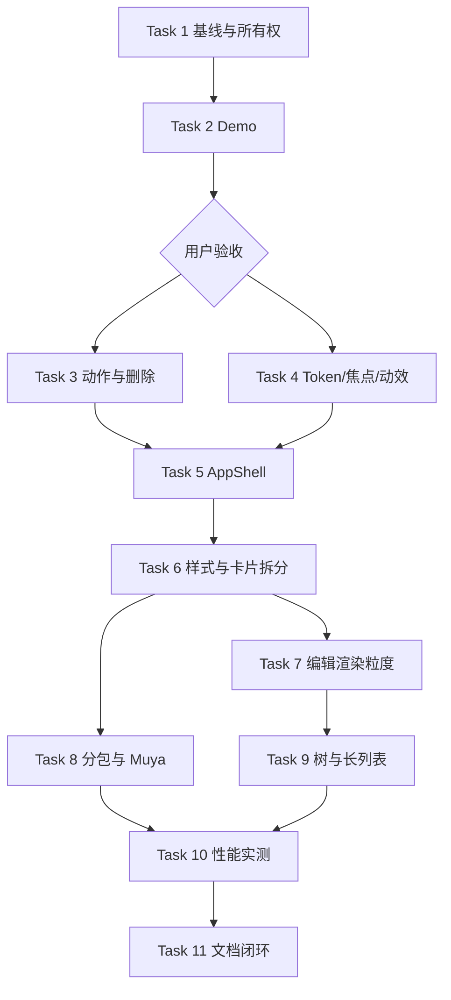

# Trace Frontend Experience and Foundation Implementation Plan

> **For agentic workers:** REQUIRED SUB-SKILL: Use superpowers:subagent-driven-development (recommended) or superpowers:executing-plans to implement this plan task-by-task. Steps use checkbox (`- [ ]`) syntax for tracking.

**Goal:** 在不推翻“迹 · Trace Mark”视觉语言的前提下，统一动作组件与删除语义，补齐可访问性和减弱动效，并消除高频编辑全量克隆、全卡重渲染、单一首屏 chunk 和视图骨架重复问题。

**Architecture:** 先用独立 Demo 冻结动作语义与视觉，再建立共享 UI primitive 和 AppShell；随后把文档编辑从“完整 PlanDocument 高频复制”收敛为组件级草稿与批量持久化，最后实施路由/Muya 懒加载和真实 Electron 性能基线。每个阶段均可独立验收和回退，任何智能体开工前必须在 `docs/HANDOFF-CURRENT.md` 登记文件所有权。

**Tech Stack:** Electron 44、React 19、TypeScript 5、zustand 4、Ant Design 5、electron-vite 5、Vitest 5、Muya 0.2.0、CSS View Transitions、dnd-kit。

**Status:** Task 1–9 完成；下一步 Task 10 真实 Electron 性能报告（2026-09-23）
**Created:** 2026-09-15  
**Audit:** `docs/audit/2026-09-15-frontend-ui-performance-architecture-audit.md`

---

## 1. 文件边界图

### 新建文件

| 文件                                                   | 单一职责                                                       |
| ------------------------------------------------------ | -------------------------------------------------------------- |
| `demo/frontend-foundation/index.html`                  | 动作语义、删除确认/撤销、焦点和减弱动效的用户验收 Demo         |
| `demo/frontend-foundation/style.css`                   | Demo 独立样式，不进入正式应用                                  |
| `demo/frontend-foundation/main.ts`                     | Demo 交互，不读真实计划数据                                    |
| `src/renderer/src/components/ui/ActionButton.tsx`      | Primary/Secondary/Quiet/Danger/Icon 五类动作入口               |
| `src/renderer/src/components/ui/ConfirmAction.ts`      | 上下文化确认弹层的统一配置入口                                 |
| `src/renderer/src/components/ui/UndoNotice.tsx`        | 低粒度删除的 5 秒撤销提示与焦点恢复                            |
| `src/renderer/src/components/AppShell.tsx`             | TopBar、可选 StatusBar、页面主区域的统一骨架                   |
| `src/renderer/src/components/cards/CardShell.tsx`      | 卡片外壳、排序手柄、升降、删除动作                             |
| `src/renderer/src/components/cards/card-registry.tsx`  | Component type 到卡片组件的唯一映射                            |
| `src/renderer/src/components/cards/SinglePlanCard.tsx` | 单选计划卡                                                     |
| `src/renderer/src/components/cards/MultiPlanCard.tsx`  | 多选计划卡                                                     |
| `src/renderer/src/components/cards/TaskListCard.tsx`   | 任务列表卡与任务行                                             |
| `src/renderer/src/components/cards/TaskDetailCard.tsx` | 任务详情卡                                                     |
| `src/renderer/src/components/cards/MoodCard.tsx`       | 心情卡与颜色展示                                               |
| `src/renderer/src/components/cards/HeadingCard.tsx`    | 标题卡                                                         |
| `src/renderer/src/components/cards/FallbackBlock.tsx`  | 未知类型降级展示                                               |
| `src/renderer/src/styles/tokens.css`                   | 亮暗主题、文字、间距、圆角、阴影和动效 token                   |
| `src/renderer/src/styles/base.css`                     | reset、字体、滚动条、全局 focus-visible 和 reduced-motion 基线 |
| `src/renderer/src/styles/actions.css`                  | 五类动作组件视觉与状态                                         |
| `src/renderer/src/styles/shell.css`                    | AppShell、顶栏、状态栏、响应式页面容器                         |
| `src/renderer/src/styles/tree.css`                     | 计划树、拖拽、展开/收拢动效                                    |
| `src/renderer/src/styles/cards.css`                    | 卡片、任务、心情、标题、注释宿主                               |
| `src/renderer/src/styles/diary.css`                    | 日记页和窄窗口降级                                             |
| `src/renderer/src/styles/memories.css`                 | 回忆页和窄窗口降级                                             |
| `src/renderer/src/styles/search.css`                   | 搜索浮层、结果和焦点样式                                       |
| `src/renderer/src/stores/undo-store.ts`                | 可撤销动作的单槽状态与 5 秒生命周期                            |
| `src/renderer/src/perf/marks.ts`                       | 冷启动、编辑、树动画和 Muya 激活性能标记                       |
| `test/action-policy.spec.ts`                           | 删除策略、撤销时限和危险动作规则                               |
| `test/plan-editing.spec.ts`                            | 组件级编辑不影响无关组件引用的回归测试                         |
| `test/bundle-budget.spec.ts`                           | 构建产物 chunk 和体积预算检查                                  |
| `test/accessibility-contract.spec.tsx`                 | 动作按钮 aria、键盘和焦点契约                                  |

### 修改文件

| 文件                                                                  | 修改职责                                                       |
| --------------------------------------------------------------------- | -------------------------------------------------------------- |
| `src/renderer/src/App.tsx`                                            | 只保留阶段/视图分发、全局底座和懒加载边界；移出设置主体        |
| `src/renderer/src/main.tsx`                                           | 导入拆分后的样式入口和统一主题 token                           |
| `src/renderer/src/views/WorkspaceView.tsx`                            | 接入 AppShell，移除硬编码白底和重复 TopBar/StatusBar           |
| `src/renderer/src/views/DiaryView.tsx`                                | 接入 AppShell 和窄窗口预览布局                                 |
| `src/renderer/src/views/MemoriesView.tsx`                             | 接入 AppShell 和窄窗口预览布局                                 |
| `src/renderer/src/components/TopBar.tsx`                              | 使用细粒度 store selector 和统一 ActionButton                  |
| `src/renderer/src/components/ContentArea.tsx`                         | 使用细粒度 selector、语义按钮、确认/撤销策略                   |
| `src/renderer/src/components/PlanTreePanel.tsx`                       | 收窄订阅、统一按钮与键盘节点，保留当前树动效语义               |
| `src/renderer/src/components/cards.tsx`                               | 分批迁出 CardShell/卡片注册表；不得与 Muya NoteCard 所有权重叠 |
| `src/renderer/src/components/SearchOverlay.tsx`                       | 语义结果按钮、结果上限和焦点管理                               |
| `src/renderer/src/components/NameDialogModal.tsx`                     | loading、防重复提交、输入标签和焦点回归                        |
| `src/renderer/src/stores/plan-store.ts`                               | 组件级编辑接口、持久化快照和防抖保存                           |
| `src/renderer/src/stores/tree-store.ts`                               | 为按路径 selector 提供稳定引用，避免无关树节点重渲染           |
| `src/renderer/src/stores/pref-store.ts`                               | 仅在 Muya 所有权显式交接后补设置描述/实时渲染偏好              |
| `src/renderer/src/components/muya-note/muya-runtime.ts`               | 仅在正式集成任务中改为懒加载插件组；本计划不得提前改 Muya 行为 |
| `electron.vite.config.ts`                                             | renderer manualChunks 与构建分析开关                           |
| `docs/lifecycle/02-系统设计 Design/UI设计规范 UI Guidelines.md`       | 以最终验收结果更新动作、动效、暗色和响应式规范                 |
| `docs/lifecycle/02-系统设计 Design/前端详细设计 Frontend Design.md`   | 更新 AppShell、Diary、Memories、Muya 和状态结构                |
| `docs/lifecycle/02-系统设计 Design/架构设计文档 Architecture.md`      | 更新前端模块边界和性能策略                                     |
| `docs/lifecycle/04-测试阶段 Testing/性能测试报告 Performance Test.md` | 替换无关的服务器/订单模板，写入 Electron 实测结果              |

### 所有权约束

- 当前 Codex 已持有 Muya 快照/适配层/Demo、`cards.tsx` NoteCard 段、`note-md.tsx`、`pref-store.ts` 和设置宿主。
- Claude Code 在未完成显式交接前不得修改上述边界。
- AppShell、样式拆分、计划树性能和通用动作组件开工前必须重新读取 `docs/HANDOFF-CURRENT.md`；若另一智能体已登记相关文件，必须先拆分文件边界。
- `Resource/pic/`、`Resource/vid/` 是用户未跟踪资源，任何任务均不得暂存、删除或重命名。

---

## 2. 验收门槛

所有正式代码任务完成时均必须满足：

```bash
npm run typecheck
npm run test
npm run build
```

期望：TypeScript 0 错；Vitest 全绿；main/preload/renderer 构建成功。

视觉类任务额外验收：

- 亮色、暗色、跟随系统三种主题；
- 720×480、959px、960px、1200×800 四档窗口；
- 100%、125%、150% Windows DPI；
- 键盘 Tab/Shift+Tab/Enter/Space/Escape；
- `prefers-reduced-motion: reduce`；
- 长中文、长英文、长路径、空内容和 1000 条任务样本；
- 不出现布局顶动、浮层裁切、拖拽洞、暗色白块或焦点丢失。

---

### Task 1: 建立可复现基线与计划所有权

**Files:**

- Modify: `docs/HANDOFF-CURRENT.md`

- Modify: `docs/Plan/Future_Plan/Qore/Trace/Plan-260915-01-前端体验与地基整改/Frontend-Experience-Foundation-Implementation-Plan.md`

- Modify: `docs/Plan/Future_Plan/Qore/Trace/Plan-260915-01-前端体验与地基整改/plan.json`

- [x] **Step 1: 核对协作基线**

Run:

```bash
git status --short --branch
git log -1 --oneline
```

Expected: 分支、HEAD、远端领先状态与 `HANDOFF-CURRENT.md` 一致；工作区例外仅包含已登记的用户资源或其他智能体已登记文件。

- [x] **Step 2: 登记首批文件所有权**

在 `HANDOFF-CURRENT.md` 写清执行者、任务编号、精确文件清单、是否允许另一智能体并行、下一检查点。

- [x] **Step 3: 采集未优化基线**

Run:

```bash
npm run typecheck
npm run test
npm run build
```

Expected: 记录实际测试数、构建时间、renderer JS/CSS 文件名与字节数；不得只写“通过”。

- [x] **Step 4: 提交基线记录**

```bash
git add docs/HANDOFF-CURRENT.md docs/Plan/Future_Plan/Qore/Trace/Plan-260915-01-前端体验与地基整改
git commit -m "docs(plan): 启动前端体验与地基整改"
```

---

### Task 2: 先做动作系统与删除语义 Demo

**Files:**

- Create: `demo/frontend-foundation/index.html`

- Create: `demo/frontend-foundation/style.css`

- Create: `demo/frontend-foundation/main.ts`

- [x] **Step 1: 编写 Demo 验收矩阵**

页面必须同时展示 Primary、Secondary、Quiet、Danger、Icon 五类按钮，以及组件卡删除确认、任务行删除后 5 秒撤销、键盘焦点和减弱动效四条路径。

- [x] **Step 2: 实现隔离 Demo**

Demo 只使用内存样本，不访问 IPC、真实计划目录或 localStorage。删除任务行时保存 `{ item, index }`，撤销时按原索引恢复；重复删除只保留最近一条可撤销记录。

- [x] **Step 3: 验证键盘与主题**

Expected:

- Enter/Space 能触发按钮；

- Escape 关闭确认层并恢复触发按钮焦点；

- Icon 按钮均有可访问名称；

- 暗色无硬编码白块；

- reduced-motion 下所有位移、缩放、淡入在 50ms 内完成或关闭。

- [x] **Step 4: 用户验收 Demo**

暂停正式集成，记录用户对按钮密度、危险色强度、确认范围、撤销时长和动效的结论。只有“已确认”的结论才可进入 Task 3。

- [x] **Step 5: 提交 Demo**

```bash
git add demo/frontend-foundation docs/HANDOFF-CURRENT.md docs/Plan/Future_Plan/Qore/Trace/Plan-260915-01-前端体验与地基整改
git commit -m "feat(demo): 添加前端动作系统验收原型"
```

---

### Task 3: 建立共享动作组件与删除策略

**Files:**

- Create: `src/renderer/src/components/ui/ActionButton.tsx`

- Create: `src/renderer/src/components/ui/ConfirmAction.ts`

- Create: `src/renderer/src/components/ui/UndoNotice.tsx`

- Create: `src/renderer/src/stores/undo-store.ts`

- Create: `test/action-policy.spec.ts`

- Create: `test/accessibility-contract.spec.tsx`

- Modify: `src/renderer/src/components/ContentArea.tsx`

- Modify: `src/renderer/src/components/PlanTreePanel.tsx`

- Modify: `src/renderer/src/components/cards.tsx` outside NoteCard-owned range only

- [x] **Step 1: 写删除策略失败测试**

测试必须断言：高价值对象走确认；任务行/选项返回可撤销快照；撤销按原索引恢复；5 秒后快照失效；重复确认不会执行两次删除。

- [x] **Step 2: 运行定向测试并确认失败**

```bash
npx vitest run test/action-policy.spec.ts test/accessibility-contract.spec.tsx
```

Expected: FAIL，原因是动作组件和撤销 store 尚不存在。

- [x] **Step 3: 实现动作类型契约**

`ActionButton` 对外接口固定为：

```ts
type ActionIntent = 'primary' | 'secondary' | 'quiet' | 'danger' | 'icon'

interface ActionButtonProps {
  intent: ActionIntent
  label: string
  icon?: React.ReactNode
  disabled?: boolean
  loading?: boolean
  onClick: () => void
}
```

`intent='icon'` 必须把 `label` 写入 `aria-label`；非 icon 类型必须显示具体动作文字。

- [x] **Step 4: 实现确认与撤销**

`ConfirmAction` 必须通过 `getModal()`，禁止静态 `Modal.confirm`。撤销 store 只保留一个槽位：

```ts
interface UndoEntry {
  id: string
  expiresAt: number
  undo: () => void
  description: string
}
```

关闭通知、超时和执行撤销都必须清理 timer。

- [x] **Step 5: 接入删除入口**

- 树节点、组件卡、预设：确认后删除；

- 任务行、选项：立即删除并登记 5 秒撤销；

- 删除成功后焦点落到同层下一项、上一项或容器；

- 不修改 NoteCard 的 Muya 行为。

- [x] **Step 6: 验证并提交**

```bash
npx vitest run test/action-policy.spec.ts test/accessibility-contract.spec.tsx
npm run typecheck
git add src/renderer/src/components/ui src/renderer/src/stores/undo-store.ts src/renderer/src/components/ContentArea.tsx src/renderer/src/components/PlanTreePanel.tsx src/renderer/src/components/cards.tsx test/action-policy.spec.ts test/accessibility-contract.spec.tsx
git commit -m "feat(ui): 统一动作组件与删除策略"
```

---

### Task 4: 收敛 token、对比度、焦点与减弱动效

> 2026-09-16 恢复：代码基线 `9478fb9`、文档 HEAD `c51c3a5`；执行者 Codex，精确文件边界见 HANDOFF 顶部。先补失败回归，再实施及三跑，不进入 Task 5 或 Muya 集成。

**Files:**

- Create: `src/renderer/src/styles/tokens.css`

- Create: `src/renderer/src/styles/base.css`

- Modify: `src/renderer/src/styles/actions.css`（Task 3 已创建）

- Create: `src/renderer/src/styles/antd-theme.ts`（正式与 QA 共用语义桥）

- Create: `test/frontend-foundation-css.spec.ts`、`test/score-accessibility.spec.ts`

- Modify: `src/renderer/src/styles/workspace.css`

- Modify: `src/renderer/src/main.tsx`

- Modify: `src/renderer/src/views/WorkspaceView.tsx`

- Modify: `components/StatusBar.tsx`、`TopBar.tsx`、`SearchOverlay.tsx`、`ContentArea.tsx`、`PlanTreePanel.tsx`、`cards.tsx`（非 NoteCard）、`views/DiaryView.tsx`、`MemoriesView.tsx`、`demo/frontend-foundation/`（以上均相对 renderer/src，Demo 除外；见 HANDOFF 精确边界）

- [x] **Step 1: 建立颜色对比测试数据**

将普通 11–14px 文字目标设为至少 4.5:1；纯装饰和禁用文本可使用 `text-4`，但不得承载日期、状态、类型和空态说明。

- [x] **Step 2: 拆出 token 与基础样式**

`tokens.css` 保留全部主题值；`base.css` 保留 reset、字体、滚动条、全局 focus-visible、View Transition 和 reduced-motion。`workspace.css` 在拆分完成前只作为兼容入口导入子文件，避免一次性大改选择器。

- [x] **Step 3: 修复硬编码与焦点**

- 将 `WorkspaceView.tsx` 的 `#fff` 替换为语义 token；

- 所有移除 outline 的输入必须有 `:focus-visible` 或 `:focus-within` 替代；

- 所有可点击 `span/div` 改为原生 button，或补齐 role、tabIndex、Enter/Space；

- 状态栏异步保存/索引状态增加 `aria-live="polite"`。

- [x] **Step 4: 清除全属性动画**

将 `transition: all` 改成明确属性；把 memories、fmt、folder、window controls 纳入 reduced-motion；树高度动画暂时保留，等待 Task 9 FPS 数据决定是否更换。

- [x] **Step 5: 验证并提交**

```bash
npm run typecheck
npm run test
npm run build
git add src/renderer/src/styles src/renderer/src/main.tsx src/renderer/src/views/WorkspaceView.tsx
git commit -m "refactor(ui): 收敛主题焦点与减弱动效"
```

---

### Task 5: 提升 AppShell 并统一响应式骨架

> 2026-09-16 启动：main HEAD `352912a`、ahead 18；窄窗口采用右列下移，保留全部功能，不新增 Drawer 状态。精确所有权与验证状态见 HANDOFF。

> 2026-09-16 完成：代码提交 `5659fe4` 已快进 main。最终 typecheck 0 错、23 文件 216/216、build 成功（renderer 3166 modules、8.30s、JS 2642.81kB、CSS 52.39kB）；720/959/960/1200 Chrome/CDP 真实组件回归通过，规格与质量双审查通过。Electron 真机/DPI 仍待后续验收。

**Files:**

- Create: `src/renderer/src/components/AppShell.tsx`

- Create: `src/renderer/src/styles/shell.css`

- Modify: `src/renderer/src/App.tsx`

- Modify: `src/renderer/src/views/WorkspaceView.tsx`

- Modify: `src/renderer/src/views/DiaryView.tsx`

- Modify: `src/renderer/src/views/MemoriesView.tsx`

- Modify: `src/renderer/src/components/TopBar.tsx`

- Modify: `src/renderer/src/components/StatusBar.tsx`

- [x] **Step 1: 写 AppShell 结构测试**

断言 workspace/diary/memories 切换时 TopBar 只存在一个；StatusBar 的显示规则由 AppShell 属性决定；全局弹层不随视图切换卸载。

- [x] **Step 2: 实现 AppShell 契约**

```ts
interface AppShellProps {
  children: React.ReactNode
  showStatus?: boolean
  className?: string
}
```

AppShell 单点渲染 TopBar；`showStatus` 默认 false，由 App 对 workspace 显式传 true，保持当前日记/回忆不显示 StatusBar 的行为。若用户要求三视图常驻状态栏，再单独记录产品确认后变更。

- [x] **Step 3: 迁移三个视图**

视图组件只返回页面内容，不再自行创建 `100vh` 根、TopBar 或 StatusBar。AppShell 提供统一的 `min-height: 0`、滚动边界和窄窗口容器。

- [x] **Step 4: 增加日记/回忆窄窗口降级**

在 `<960px` 时将 300px 预览区切换为 Drawer 或内容下方区域；不得通过简单隐藏导致功能消失。

- [x] **Step 5: 验证并提交**

```bash
npm run typecheck
npm run test
npm run build
git add src/renderer/src/App.tsx src/renderer/src/components/AppShell.tsx src/renderer/src/components/TopBar.tsx src/renderer/src/components/StatusBar.tsx src/renderer/src/views src/renderer/src/styles/shell.css
git commit -m "refactor(shell): 统一多视图应用骨架"
```

---

### Task 6: 拆分全局样式与卡片职责

> 2026-09-16 完成：代码提交 `1483d6e` 已快进 main。只做机械迁移；NoteCard 函数体与 Muya/pref/settings 边界保持冻结。精确验证与限制见 HANDOFF。

**Files:**

- Create: `src/renderer/src/styles/tree.css`

- Create: `src/renderer/src/styles/cards.css`

- Create: `src/renderer/src/styles/diary.css`

- Create: `src/renderer/src/styles/memories.css`

- Create: `src/renderer/src/styles/search.css`

- Create: `src/renderer/src/components/cards/CardShell.tsx`

- Create: `src/renderer/src/components/cards/card-registry.tsx`

- Create: `src/renderer/src/components/cards/SinglePlanCard.tsx`

- Create: `src/renderer/src/components/cards/MultiPlanCard.tsx`

- Create: `src/renderer/src/components/cards/TaskListCard.tsx`

- Create: `src/renderer/src/components/cards/TaskDetailCard.tsx`

- Create: `src/renderer/src/components/cards/MoodCard.tsx`

- Create: `src/renderer/src/components/cards/HeadingCard.tsx`

- Create: `src/renderer/src/components/cards/FallbackBlock.tsx`

- Modify: `src/renderer/src/styles/workspace.css`

- Modify: `src/renderer/src/components/cards.tsx`

- [x] **Step 1: 按职责机械迁移 CSS**

先只移动规则，不改选择器和值；每移动一组即运行构建，确保 cascade 顺序不变。`workspace.css` 最终仅按固定顺序导入 token、base、actions、shell、tree、cards、search、diary、memories 和 Muya bridge。

- [x] **Step 2: 抽出 CardShell**

迁移卡片外壳、排序手柄、升降和删除动作；保持 `data-component-id`、dnd transform、拖动 class 和导出隐藏选择器不变。

- [x] **Step 3: 抽出卡片注册表**

将上述七类卡片迁入精确列出的文件，使用穷尽映射替代 `ComponentRenderer` 内的大 switch；未知类型仍进入 FallbackBlock，不得丢数据。NoteCard 暂留其既有所有权文件，通过注册表导出接入，不在此任务迁移。

- [x] **Step 4: 保持 NoteCard 所有权边界**

若 Muya 正式集成仍在进行，只移动 NoteCard 外围注册，不改编辑逻辑、偏好或主题桥；冲突时暂停并更新 HANDOFF，不得自行合并覆盖。

- [x] **Step 5: 验证并提交**

```bash
npm run typecheck
npm run test
npm run build
git add src/renderer/src/styles src/renderer/src/components/cards src/renderer/src/components/cards.tsx
git commit -m "refactor(renderer): 拆分样式与卡片职责"
```

---

### Task 7: 将高频编辑收敛到组件级更新

> 2026-09-16 完成：代码提交 `0590671` 已快进 main；组件引用稳定、memo 隔离与保存竞态均有红绿测试。精确验证与限制见 HANDOFF。

**Files:**

- Create: `test/plan-editing.spec.ts`

- Modify: `src/renderer/src/stores/plan-store.ts`

- Modify: `src/renderer/src/components/ContentArea.tsx`

- Modify: `src/renderer/src/components/cards/card-registry.tsx`

- Modify: `src/renderer/src/components/cards/SinglePlanCard.tsx`

- Modify: `src/renderer/src/components/cards/MultiPlanCard.tsx`

- Modify: `src/renderer/src/components/cards/TaskListCard.tsx`

- Modify: `src/renderer/src/components/cards/TaskDetailCard.tsx`

- Modify: `src/renderer/src/components/cards/MoodCard.tsx`

- Modify: `src/renderer/src/components/cards/HeadingCard.tsx`

- [x] **Step 1: 写引用稳定性失败测试**

测试必须构造至少 100 个组件，编辑第 50 个组件后断言：被编辑组件引用变化；其他 99 个组件引用保持不变；保存快照包含最新内容；CAS 锚点语义不变。

- [x] **Step 2: 运行测试并确认失败**

```bash
npx vitest run test/plan-editing.spec.ts
```

Expected: FAIL，当前 `structuredClone(document)` 会使全部组件引用变化。

- [x] **Step 3: 实现组件级不可变更新**

新增动作：

```ts
patchComponent(componentId: string, patch: (component: Component) => Component): void
```

只复制 `PlanDocument`、`components` 数组和目标组件/目标 payload；禁止每次按键完整 `structuredClone`。防抖保存仍以当前完整文档快照写盘，CAS 冲突处理不变。

- [x] **Step 4: 隔离卡片重渲染**

卡片组件使用 `React.memo`；传入稳定的 component 引用、index、total 和动作引用。编辑目标卡时，无关卡片不得重渲染。

- [x] **Step 5: 验证输入与保存竞态**

覆盖连续输入、保存中继续输入、切计划、删除当前计划、外部变更和 CAS 冲突；不得丢最后一次输入。

- [x] **Step 6: 验证并提交**

```bash
npx vitest run test/plan-editing.spec.ts
npm run typecheck
npm run test
git add src/renderer/src/stores/plan-store.ts src/renderer/src/components/ContentArea.tsx src/renderer/src/components/cards test/plan-editing.spec.ts
git commit -m "perf(editor): 隔离组件级编辑更新"
```

---

### Task 8: 页面与 Muya 懒加载、构建预算

> 2026-09-17 已启动。正式 NoteCard 的 Muya 接入仍受真实 Demo 用户体验验收门槛约束；本任务先完成页面分包、Muya 适配层异步加载边界、Demo 回归与可复现构建预算，不修改 NoteCard/偏好/设置宿主。

**Files:**

- Create: `test/bundle-budget.spec.ts`

- Modify: `src/renderer/src/App.tsx`

- Modify: `src/renderer/src/components/muya-note/muya-runtime.ts`

- Modify: `electron.vite.config.ts`

- [x] **Step 1: 写构建预算测试**

预算以当前实测为起点：入口 JS 不得继续维持 2.63MB 单 chunk；Muya、Mermaid/Vega/PlantUML 等重型功能不得进入不含编辑器的初始 chunk。

- [x] **Step 2: 懒加载非工作台页面**

使用 `React.lazy` + `Suspense` 加载 DiaryView、MemoriesView；Workspace 保持首屏。loading fallback 使用语义 token，不能出现全白闪屏。

- [x] **Step 3: 建立 Muya 独立边界**

仅当注释进入编辑态时动态导入 Muya runtime；先核对 vendor 内已有的图表动态 import，保留现有 Mermaid/Vega 等延迟加载边界，不为分包目的重写上游插件行为。退出编辑时销毁实例和事件监听，但保留 Markdown 真源。

完成：`d0acd3b` 将动态 Muya 适配器接入正式 NoteCard；同一时刻仅一个实例活动，退出时 flush 最终 Markdown 并 destroy，非活动卡保持静态渲染，vendor 图表继续按需加载。正式卡片的人机体验验收由独立 Muya 集成计划继续跟踪。

- [x] **Step 4: 配置稳定 manualChunks**

优先使用页面和 Muya 的自然动态 import 边界。仅在构建分析确认有收益且没有循环 chunk 警告时，使用稳定 manualChunks 分离 React、Antd 和 dnd；不得强行把有共享运行时依赖的 Muya 模块拆散。

- [x] **Step 5: 验证构建产物**

```bash
npm run build
npx vitest run test/bundle-budget.spec.ts
```

Expected: 生成多个职责明确的 chunk；不进入注释编辑时不请求 Muya 与图表 chunk；构建预算测试通过。

- [x] **Step 6: 提交**

```bash
git add src/renderer/src/App.tsx src/renderer/src/components/muya-note/muya-runtime.ts electron.vite.config.ts test/bundle-budget.spec.ts
git commit -m "perf(bundle): 延迟加载页面与 Muya 运行时"
```

#### Task 8 本批交付（2026-09-17）

- `14cef79` 已 fast-forward 到 main：Diary/Memories 懒加载与语义 fallback、React/Antd/dnd 稳定分包、Muya 动态运行时 loader、真实 Demo 异步启动，以及可复现构建预算。
- renderer 入口由单一 2,645,435 B 降为 634.15 kB，并拆出 React 555.79 kB、Antd 1,315.45 kB、dnd 116.05 kB、Diary 14.98 kB、Memories 9.44 kB；无循环 chunk 警告，既有三条 store 混合导入警告已清零。
- Muya Demo 入口 4.86 kB；Muya 核心 1,492.52 kB 为异步块，Mermaid/Vega 等继续按需拆分。没有修改 vendor 行为、NoteCard、偏好或设置宿主。
- 主目录最终验证：typecheck 0 错；27 文件 234/234；正式 build 成功且 renderer 3174 模块、10.14s、无警告；Demo build 3998 模块、18.82s 成功。正式 NoteCard 激活仍等待 Demo 用户体验验收，Task 8 不标记全部完成。

---

### Task 9: 优化计划树订阅与长列表

> 2026-09-23 Codex 接手；启动时 main `edd7176`，代码提交实测 `0fe64f2` 位于 `codex/frontend-foundation-task9`，尚未合入 main。文件边界与等待项见 HANDOFF 顶部。先计数诊断与失败测试，再实施订阅收窄、分段搜索与动画采样。

**Files:**

- Modify: `src/renderer/src/components/PlanTreePanel.tsx`

- Modify: `src/renderer/src/stores/tree-store.ts`

- Modify: `src/renderer/src/components/SearchOverlay.tsx`

- Modify: search IPC/service contract only if result limit cannot stay renderer-local

- Test: corresponding tree/search specs

- [x] **Step 1: 添加树渲染计数诊断测试**

构造至少 1000 个可见节点，展开一个叶级父节点；记录展开前后被重新渲染的 Row 数。优化目标是无关分支不重渲染。

- [x] **Step 2: 收窄 selector**

节点只订阅自身 `expanded`、`loaded`、`selected` 和直接 children；Context value 使用 `useMemo`，动作使用稳定 callback。禁止每个 Slot 订阅完整 `expandedKeys` 数组。

- [x] **Step 3: 约束搜索结果**

首屏最多渲染 100 条结果；超过时分段加载或虚拟化，并显示总数。搜索结果项改为语义 button，保留路径和高亮。

- [x] **Step 4: 验证树动效**

在 100、1000 可见节点下采样展开/收拢 FPS 和 Layout 时间。若 P95 帧超过 16.7ms，再将大树的高度动画降级为 opacity/transform 或关闭 stagger；小树保留当前“发牌/收牌”语义。

- [x] **Step 5: 提交**

```bash
npm run typecheck
npm run test
git add src/renderer/src/components/PlanTreePanel.tsx src/renderer/src/stores/tree-store.ts src/renderer/src/components/SearchOverlay.tsx test
git commit -m "perf(tree): 收窄树订阅与搜索渲染"
```

2026-09-23 隔离验收记录：`demo/frontend-foundation/tree-perf-check.mjs` 在 Chromium CDP 内存宿主构造 1000 行，展开一个含 4 个子项的中间文件夹，优化前无关行重渲染 999 次，优化后 0 次；`search-paging-check.mjs` 注入 250 条，验收首批 100、再次 200、最终 250、换查询恢复 1 条及原生 button。100/1000 行展开与收拢各采样约 700ms；优化前 1000 行收拢曾见 P95 帧间隔约 548ms，300 行以上跳过收牌波次并直接卸载后，最新 1000 行展开/收拢 P95 为 16.7/16.8ms；100 行展开/收拢为 16.8/50.1ms，保留原动画。Tracing `AnimationFrame::StyleAndLayout` 累计约 0.59–0.68ms；CDP `LayoutDuration` 始终报 0，不作为真实布局耗时。以上仅浏览器宿主单轮诊断，不代表 Electron 真机或稳定帧率。最终 typecheck 0 错、28 文件 244/244、`npm run build` 成功；正式真机性能与 DPI 留给 Task 10。

2026-09-23 本地集成：用户选项 1；main 经 `git merge --ff-only` 从 `ac0623c` 前进到实测 `29305f6`，未拉取或推送远端。合并后在 main 重跑 `npm run typecheck` 0 错、`npm run test` 28 文件 244/244、`npm run build` 成功。Task 9 已完成；下一个执行项为 Task 10，须先登记新文件所有权。正式 Muya 卡片人工体验验收仍独立待反馈。

---

### Task 10: 建立真实 Electron 性能报告

**Files:**

- Create: `src/renderer/src/perf/marks.ts`

- Modify: `docs/lifecycle/04-测试阶段 Testing/性能测试报告 Performance Test.md`

- Modify: performance scripts under `scripts/` with a Trace-specific filename

- [ ] **Step 1: 定义本地桌面指标**

记录：冷启动首个可交互帧、空闲内存、编辑 P50/P95、100/1000 任务渲染、1000 节点树展开 FPS、搜索端到端耗时、Muya 首次激活和图表渲染耗时。

- [ ] **Step 2: 增加 Performance API 标记**

生产代码只保留低成本 mark/measure；详细采样由开发/测试开关启用。指标名必须稳定，例如：

```ts
'trace:app-interactive'
'trace:plan-open'
'trace:edit-commit'
'trace:tree-expand'
'trace:muya-activate'
```

- [ ] **Step 3: 建立两档样本库**

- 标准：100 计划、1000 任务；

- 上限：1000 计划、10000 任务；

- 样本写入临时目录，不读取或污染用户真实计划库。

- [ ] **Step 4: 替换无关性能模板**

删除服务器 CPU、MySQL、登录、订单和 1000 并发用户口径，改为 Electron/renderer/main/IPC/文件 IO 指标；每项填写机器配置、样本规模、测量次数、P50/P95 和原始记录位置。

- [ ] **Step 5: 提交真实性能报告**

```bash
git add src/renderer/src/perf scripts "docs/lifecycle/04-测试阶段 Testing/性能测试报告 Performance Test.md"
git commit -m "test(perf): 建立 Electron 性能基线"
```

---

### Task 11: 同步设计与架构文档

**Files:**

- Modify: `docs/lifecycle/02-系统设计 Design/UI设计规范 UI Guidelines.md`

- Modify: `docs/lifecycle/02-系统设计 Design/前端详细设计 Frontend Design.md`

- Modify: `docs/lifecycle/02-系统设计 Design/架构设计文档 Architecture.md`

- Modify: `docs/Plan/README.md`

- Modify: this plan

- Modify: `docs/HANDOFF-CURRENT.md`

- [ ] **Step 1: 更新 UI 真源**

写入亮暗主题、五类动作语义、删除确认/撤销矩阵、最终按钮尺寸、文本对比度、焦点、减弱动效和经用户确认的 spring/时长。

- [ ] **Step 2: 更新前端结构**

文档必须包含 AppShell、Workspace/Diary/Memories、全局弹层、卡片注册表、组件级编辑、Muya lazy boundary 和性能标记。

- [ ] **Step 3: 清理失效陈述**

删除不存在的 `src/shared/design-tokens.ts`、旧树宽 220–400、旧三视图描述和“全部基础组件取 antd”等不再成立的文字，或将其更新为真实实现。

- [ ] **Step 4: 最终全量验证**

```bash
npm run typecheck
npm run test
npm run build
git status --short --branch
```

Expected: 三项命令全部通过；工作区只保留用户资源和已明确说明的文件；计划 Markdown、`plan.json`、索引和 HANDOFF 状态一致。

- [ ] **Step 5: 提交文档闭环**

```bash
git add docs/lifecycle docs/Plan docs/HANDOFF-CURRENT.md
git commit -m "docs(frontend): 同步体验性能与架构规范"
```

---

## 3. 执行顺序与并行边界



- Task 3 与 Task 4 可在文件边界明确后并行。
- Task 7 与 Task 8 不得与 Muya 正式集成同时修改 `cards.tsx`、`pref-store.ts` 或 `muya-runtime.ts`。
- Task 9 可与 Muya 工作并行，但必须避开其所有权文件。
- Task 11 只能在实际实现和验证完成后执行，禁止提前把计划写成已实现。

## 4. 当前下一步、等待与剩余工作

### Task 7 完成交付（2026-09-16）

- 正式提交 `0590671` 已快进 main：组件级更新只替换目标引用链，注册表统一 memo 卡片；结构变更和 IPC 保存合约保持原路径。
- 会话代次、编辑修订号与待保存操作重放共同解决保存中继续输入、切换/删除计划及 CAS 竞态；组件 patch 冻结首次结果，避免生成 ID 等回调在冲突重放时二次执行。
- TDD 多轮红绿覆盖 100 组件引用稳定、完整保存快照、CAS 锚点、memo、连续输入、旧保存隔离、外部变更、冲突重放与非确定回调。主目录最终复验 typecheck 0、26 文件 230/230、build 成功（renderer 3174 modules、9.09s、JS 2645.44kB、CSS 53.21kB）。
- 实际只改四个必要文件；ContentArea、六个卡片与 NoteCard/Muya/pref/settings 均未机械修改。既有三组分包警告留待 Task 8。
- 下一步：Task 8 页面与 Muya 懒加载、构建预算；等待 Muya Demo 用户验收。剩余 Task 8–11、真实 Electron/DPI、真实数据视觉与真实性能验收。

### Task 6 完成交付（2026-09-16）

- 正式提交 `1483d6e` 已快进 main：CSS 按 shell/tree/cards/search/diary/memories 拆域，卡片外壳、七类卡片、FallbackBlock 与穷尽注册表完成拆分；未知/`custom` 回退行为保留。
- NoteCard 函数体与基线逐字符一致，Muya、偏好与设置边界未改；删除 ActionButton 重复样式导入前先补失败测试，最终构建产物 `.trace-action` 根规则仅一份。
- 最终复验：typecheck 0 错，25 文件 221/221，build 成功（renderer 3174 modules、10.00s、JS 2642.17kB、CSS 52.99kB）；既有三组 store 混合导入警告留待 Task 8。
- 浏览器验收受本机 Chrome/Edge GPU/CDP 异常影响未形成新的完整通过证据；同一 Electron 宿主对新旧基线在相同固定等待断言处表现一致，稳定后 DOM 正确，未发现本批独有回归，但 Electron/DPI 仍待真机验证。
- 下一步：Task 7 组件级编辑更新；等待 Muya Demo 用户验收。剩余 Task 7–11、真实 Electron/DPI、真实数据视觉与真实性能验收。

### Task 5 完成交付（2026-09-16）

- `AppShell` 统一承载 TopBar、主内容和 workspace 专属 StatusBar；三个视图移除自有外壳，全局 NameDialog/Search/Undo/Settings 保持在 active view 外。
- `<960px` 的日记时间线与回忆预览下移到主内容之后，960px 起保持双栏；720/959/960/1200 无横向溢出，中英文顶栏均保持单行。
- 代码提交 `5659fe4`；主智能体最终复验 typecheck 0、23 文件 216/216、build 成功（renderer 3166 modules、8.30s、JS 2642.81kB、CSS 52.39kB），浏览器 runtime exception 0；既有三条分包警告留待 Task 8。
- 独立规格/质量审查均通过。非阻塞债务：部分契约测试依赖源码/CSS 正则；QA 证明全局宿主身份保持但未逐个检查每个浮层 DOM 身份。
- 下一步：Task 6 拆分 `workspace.css` 与 `cards.tsx`；等待用户确认、Muya Demo 用户验收。剩余 Task 6–11、完整 Electron/DPI、真实数据视觉与真实性能验收。

### Task 4 完成交付（2026-09-16）

- 正式提交 `5275a26`，21 文件已快进主目录，未推送；Task 4 全部步骤完成。测试先红后绿，规格复核退回的动态分数与搜索 Escape 已修复，复核通过；质量审查无阻塞项。
- 主目录实际复验：typecheck 0 错，22 文件 210/210，build main/preload/renderer 成功；renderer 3165 模块、8.54s，JS 2643.18kB、CSS 52.18kB（舍入值）。既有三条混合导入分包警告未掩盖，待 Task 8。
- 浏览器：实现者修后双脚本连续两轮串行通过，主智能体另独立串行通过；信息/动态读数/antd 按钮样本最低 4.82497:1，真实 focus、菜单/搜索 Enter/Space、结果 Escape、状态播报属性、减动效下任务撤销/树删除一次及焦点终态、树快捷按钮键盘可见、四档宽度、暗色确认和旧撤销均通过，无运行时异常。
- hover 同步根因已清理：脚本曾在 submenu 尺寸为零时误发坐标；现等待非零尺寸、父动画结束与命中后 hover。生产逻辑未改，诊断仅留忽略的截图产物。
- 下一步 Task 5 AppShell；等待已验收三视图骨架提升确认与 Muya Demo 用户验收；剩余 Task 5–11、真实 Electron/DPI 性能和完整回忆页视觉验收。本轮不提前实施 Task 5。
- 收尾自检：改动/缺陷/解决方案已落共享实施记录；无新增独立 ERROR、跨项目方案或新习惯记忆需写。

### Task 4 恢复与验收范围（2026-09-16）

- 用户“继续吧”恢复；实测 main HEAD `c51c3a5`，ahead 16，仅用户资源未跟踪。隔离分支已快进同一基线，基线 typecheck 0 错、20 文件 200/200。
- 本轮只收敛既有主题、文字、键盘焦点与减弱动效，不改变三视图骨架或 Muya 编辑逻辑。以下暂停记录仅作历史追溯。
- 验收：普通信息文字在亮暗 paper/paper-dim/fill/trace-bg 底色的对比；输入真实键盘焦点；非原生动作的 Enter/Space；异步状态播报；减少动效的计算样式及树删除终态；四档宽度、暗色确认与已有撤销回归。
- Chrome 内存宿主是交互回归，不替代 Windows Electron 真机及 DPI 验收；实际结果与提交待完成后写入。
- 第一轮独立复验：typecheck 0 错、21 文件 208/208、build 三段成功（renderer 3164 模块/8.43s）；基础 Chrome 回归通过，但随后旧动作回归的预设子菜单 hover 超时，正在修正 QA 时序，未宣称稳定通过。
- 规格复核退回两项：回忆 13px 动态心情文字对比不足（冷色亮/暗底 3.75/3.62、暖色亮底 2.48）；搜索结果焦点下 Escape 没有关闭出口。同时处理同根因的日记读数/时间线数字，保留连续冷暖色装饰和数字滚动语义。未提交，待失败回归与修复后再次复核。
- 修订后规格复核通过：新增 `scoreTextColor`、徽标墨色、浮层 Escape、高亮注释色及正式/QA 共用 `antd-theme.ts` 语义桥；antd 实心填充与文字色分离。0–100 每 0.01 分、双主题四底色及徽标、高亮色均达到 4.5:1。原装饰色阶及滚动逻辑未改。
- 代码冻结后的主智能体独立复验：typecheck 0 错、22 文件 210/210；实现者最终 build 成功（renderer 11.35s，既有分包警告），两套浏览器脚本修复后连续两轮串行通过。独立质量审查及主目录集成复验尚未完成，不宣称 Task 4 全部交付。

### Task 3 交付与暂停（2026-09-16）

- 用户“可以，继续”确认 Task 2 Demo；随后要求做完当前任务停工，本次仅完成 Task 3，不启动 Task 4。
- 正式实现提交 `9478fb9`（git log 实测），已快进集成到主目录；未推送。独立原型实现已吸收/清理，`demo/frontend-foundation/` 现在是复用正式 React 组件的内存集成验收宿主。
- 实际边界补充：`App.tsx` 仅挂 UndoNotice；树确认通过 `ui-store.ts` 收口；新增 `action-policy.ts` 和 `plan-row-actions.ts`、动作 CSS、双语文案；vitest include 增加 `.spec.tsx`。NoteCard/Muya 编辑逻辑未改。
- ActionButton 保留计划基本契约，并支持原生按钮属性（用于 stopPropagation、aria、className）及 icon 危险语义；默认 32px，卡片浮层采用紧凑 26×28px，避免遮挡计数。`UndoEntry` 增加 focus/dispose 生命周期回调，避免泄漏订阅及过期焦点丢失。
- TDD：首次两个测试套件因模块尚不存在失败；实现后定向 15/15。浏览器先复现“旧组件确认误删新计划同 ID 组件”与“切库后旧树确认继续执行”，修复后原场景通过。
- 已验证（隔离工作区）：`npm run typecheck` 0 错；`npm run test` 20 文件 200/200；`npm run build` 三段成功，renderer 3164 模块、8.57s、JS `index-Dnq7iYpT.js` 2,640.23kB、CSS `index-BreaePJw.css` 49.59kB（构建输出舍入值）。原有动态/静态 import 分包警告留待 Task 8，不宣称无警告。
- `node demo/frontend-foundation/integration-check.mjs`：真实 React 任务/选项原位撤销、后续编辑保留、预设确认且不改已插入内容、Enter/Space、Escape 焦点、暗色 antd 弹层、组件删除后焦点、切计划/切库旧确认失效、5 秒超时焦点、四档宽度和 reduced-motion 均通过，无运行时异常。
- 尚未做：Windows Electron 真机和 DPI 100/125/150% 人工验收；不能用 Chrome 宿主代替该验收。
- 主目录快进后再次实际三跑：typecheck 0 错、20 文件 200/200、main/preload/renderer build 成功；renderer 3164 模块、8.94s，JS `index-5HvAw3u4.js` 2,640.23kB、CSS `index-CIhEiwgx.css` 49.01kB（构建输出舍入值）。
- 恢复入口：读取本计划与 HANDOFF，重新核对 Git 状态、登记 Task 4 文件边界后再开工。当前停止，没有等待中的自主后续开发。

### 第一批记录（2026-09-16）

- 用户授权直接执行 Task 1–2；隔离工作区 `.worktrees/frontend-foundation`，分支 `codex/frontend-foundation`。

- 主目录 HEAD `cfb34eb`（忽略隔离目录）；Demo 提交 `000e48f`，未合并主分支、未推送。

- 基线/审计/计划记录已提交 `eb441e3`；Task 1 完成，Task 2 仅用户验收未完成。

- 类型检查 0 错；完整测试 18 文件 185/185；main/preload/renderer 构建通过，renderer 3157 模块、9.12s，JS 2,629,864 B。首次测试因 Git 文本行尾转换失败，已恢复来源字节并补 `.gitattributes`/文本 LF 修复；没有放宽指纹断言。

- Demo build 5 模块、146ms，JS 3.65kB、CSS 36.20kB；Demo 独立 tsc 通过。

- Chrome/CDP 验收通过：原位撤销、连续删除单槽、5 秒过期、组件确认、Escape 焦点恢复、720/959/960/1200 宽度无水平溢出、暗色与减弱动效。

- 启动：在隔离工作区执行 `npx vite demo/frontend-foundation --host 127.0.0.1 --port 52820 --strictPort`，浏览器 `http://127.0.0.1:52820/`。

- 自动测试未替代 Windows DPI、完整 Tab/Enter/Space 动线和视觉手动验收。Task 2 用户验收未完成，Task 3–11 不开工。

- 当前下一步：Task 5 AppShell 骨架提升（Task 4 已完成）。

- 当前等待：已验收视图骨架变更确认、Muya Demo 用户验收；Electron 真机视觉/DPI 验收仍待补。

- 当前剩余：Task 5–11、Muya 主线验收/正式集成及真实性能采样；本轮未启动 Task 5。
