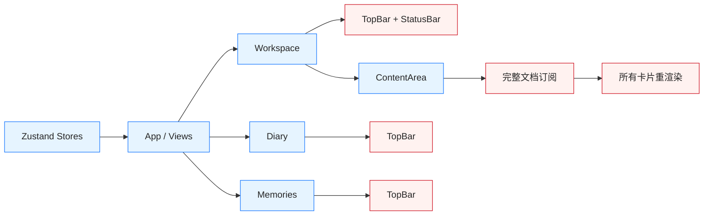

# Trace 前端 UI、性能与架构审计报告

> 审计日期：2026-09-15  
> 审计对象：`src/renderer/src/`、渲染器构建配置、现行 UI/前端设计文档  
> 审计方式：源码静态审计、设计规范对照、生产构建实测  
> 审计边界：本报告未进行 Electron 真机逐页录屏、冷启动计时、内存采样或大数据量 FPS 采样；相关结论明确区分“实测”与“代码推断”。

---

## 1. 执行摘要

Trace 已形成明确的视觉人格：

> 现代简约桌面生产力工具 + 编辑器/文件管理器骨架 + 纸面卡片系统 +“迹 · Trace Mark”路径隐喻。

当前不是纯 Ant Design，也不是 MarkText 的视觉复刻，而是：

- Ant Design 承担弹窗、输入框、基础按钮与主题算法；
- 自定义 CSS 承担计划树、卡片、标题栏、日记、回忆与业务动效；
- 蓝色路径、源头圆点、连接线与纸面卡片构成 Trace 的品牌语言。

宏观风格基本统一，微观组件规则已经开始分裂。最大风险不是“页面不好看”，而是按钮、删除、键盘交互、渲染粒度和设计规范真源尚未收口。

| 维度 | 静态审计评分 | 结论 |
|---|---:|---|
| 整体视觉语言 | 7.5/10 | 品牌、颜色、卡片和布局方向清晰 |
| 同功能组件一致性 | 5.5/10 | 按钮、删除、导航存在多套实现 |
| 排版与信息层级 | 6.5/10 | 层级清楚，但小字号、低对比使用过度 |
| 动画与反馈 | 7/10 | 有统一时序和减弱动效意识，但覆盖不完整 |
| 可访问性 | 4.5/10 | 键盘、焦点、表单标签存在系统性缺口 |
| 前端性能准备度 | 5.5/10 | 小数据可用，大计划和 Muya 集成后风险明显 |
| 前端架构 | 6.5/10 | 分层正确，但渲染粒度和设计系统边界需要收口 |

审计参考：

- 项目 UI 规范：`docs/lifecycle/02-系统设计 Design/UI设计规范 UI Guidelines.md`
- 项目前端设计：`docs/lifecycle/02-系统设计 Design/前端详细设计 Frontend Design.md`
- 外部基线：[Vercel Web Interface Guidelines](https://raw.githubusercontent.com/vercel-labs/web-interface-guidelines/main/command.md)
- React 性能检查口径：避免客户端瀑布、无效分包、过宽订阅、无界列表和高频完整对象复制。

---

## 2. 视觉、UI 与排版审计

### 2.1 已形成的统一风格

1. `workspace.css` 已集中定义亮暗色、纸面、文本、功能色、阴影和动效 token。
2. 工作台、日记、回忆均采用灰色布局底、纸面容器、轻边框、轻阴影、6–10px 圆角和蓝色主交互色。
3. 14px 正文、12–13px 辅助信息、15–16px 小标题、20px 以上重点数字，适合桌面生产力工具。
4. 主要业务图标来自 `@ant-design/icons`，没有明显的第三方图标拼接感。
5. 树连接线、源头圆点、面包屑、任务状态和回溯脉冲均服务“迹”的产品叙事。

### 2.2 视觉问题清单

| ID | 优先级 | 问题 | 证据 | 影响 |
|---|---|---|---|---|
| UI-01 | P1 | 辅助文字对比度不足 | `workspace.css:12-15,67-73` | `--text-4` 在亮色白底约 1.84:1、暗色纸面约 2.46:1，却用于日期、卡片类型、空态和组件数量等真实信息。 |
| UI-02 | P1 | 紧凑模式硬编码白底 | `WorkspaceView.tsx:65-72` | 暗色主题下树入口可能出现白块，违反语义 token 约定。 |
| UI-03 | P1 | 同语义按钮多套实现 | `workspace.css:195-215,232-246,568-608` | `lite-btn`、`dashed-btn`、`nav-btn`、`mem-roll`、`diary-cal-nav`、`mem-pv-open`、`fmt-btn` 与 Antd Button 的高度、焦点、禁用态不同。 |
| UI-04 | P1 | 键盘与焦点覆盖不完整 | `PlanTreePanel.tsx:137,176`、`ContentArea.tsx:157-180`、`SearchOverlay.tsx:101-105` | 可点击 `span/div` 缺少完整键盘行为；部分输入框移除 outline 后没有统一 `focus-visible`。 |
| UI-05 | P2 | 回忆和日记窄窗口降级不足 | `workspace.css:169,563-588` | 固定 300px 侧栏在窄窗口压缩主内容，只有工作台树拥有 `<960px` Drawer 降级。 |
| UI-06 | P2 | 内联样式过多 | `App.tsx:181-264`、`ContentArea.tsx:121-235` | 主题、排版和响应式规则分散，无法由设计系统统一约束。 |
| UI-07 | P2 | 设置项缺少延迟描述 | `App.tsx:184-240` | 尚未落实“悬停 2 秒显示配置项描述”的已确认交互要求。 |
| UI-08 | P2 | 页面标题层级偏弱 | `workspace.css:149-176,553-590` | 日记、回忆的页面/分区标题与卡片标题差异较小，页面扫描层级不足。 |

### 2.3 排版结论

排版的主要问题不是混乱，而是过度弱化：

- 标题与正文层级总体合理；
- 卡片密度符合桌面应用；
- 日期、类型、状态、空态大量落到 11–12px + `text-4`，视觉上接近不可见；
- 数字普遍使用 `tabular-nums`，方向正确；
- 长路径和卡片标题已有截断处理，但文件夹卡目前不是原生按钮，键盘行为缺失。

建议固定文本语义：

| Token | 用途 |
|---|---|
| `text-1` | 标题、核心数据 |
| `text-2` | 正文、按钮、需要持续阅读的内容 |
| `text-3` | 辅助但需要阅读的信息 |
| `text-4` | 占位、禁用和纯装饰，不承载关键信息 |

---

## 3. 同功能组件一致性审计

### 3.1 决定型按钮

做得较好的部分：

- 新建、重命名统一使用 Antd Modal；
- 删除计划/文件夹使用红色危险确认；
- 切换根目录使用普通确认；
- 设置采用即时生效 + 单一关闭按钮，语义清楚。

问题：

- 引导页选择目录后同时保留“选择目录”和“进入”两个 Primary 按钮，主次关系不够明确；
- 项目 UI 规范要求桌面应用只用中尺寸按钮，但实现中大量使用 `size="small"` 和自定义紧凑按钮；
- 自定义按钮没有统一的 loading、disabled、focus-visible 和 aria 规则。

### 3.2 删除功能不统一

| 删除对象 | 当前行为 | 证据 |
|---|---|---|
| 计划/文件夹 | 危险确认弹窗 | `ui-store.ts:52-67` |
| 整张组件卡 | 立即删除 | `cards.tsx:64-85` |
| 任务行/选项 | 立即删除 | `cards.tsx:209-233,301-325` |
| 自定义预设 | 立即删除 | `ContentArea.tsx:88-104` |

用户无法从视觉上预测一次删除是否会确认。建议统一为：

- 树节点、整张组件卡、自定义预设：危险确认；
- 普通任务行、普通选项：即时删除 + 5 秒撤销；
- 所有危险操作统一危险色、图标、文案、焦点回归和成功反馈；
- 动画完成前锁定重复操作，撤销时恢复原位置而不是追加到末尾。

### 3.3 功能性按钮

建议收敛为五种语义，而不是按页面继续新增 class：

| 语义 | 用途 | 视觉 |
|---|---|---|
| Primary | 当前界面唯一主要决定 | 实心主色 |
| Secondary | 次要但明确的动作 | 描边纸面 |
| Quiet | 卡内、树内低噪音操作 | 透明底，hover 才显底色 |
| Danger | 删除和不可逆操作 | 危险色，默认克制、确认态实心 |
| Icon | 窗口、排序、紧凑工具 | 固定热区、必须 aria-label/tooltip |

---

## 4. 动画与动效审计

### 4.1 优点

- 已建立 `--t-ui`、`--t-deal`、`--t-gather`、`--t-slot` 等时序 token；
- 卡片操作和树快捷按钮通过 opacity/transform 出入，不再顶动内容；
- 主题切换使用 View Transition；
- 树展开、收拢和定位脉冲具有明确业务含义；
- 已实现部分 `prefers-reduced-motion`；
- 心情数字动画在减弱动效下直接退化为静态数字。

### 4.2 问题清单

| ID | 优先级 | 问题 | 影响 |
|---|---|---|---|
| MOT-01 | P1 | 减弱动效覆盖不完整 | 回忆卡、回忆按钮、格式工具栏、文件夹卡、窗口按钮未纳入统一禁用清单。 |
| MOT-02 | P2 | 仍有 `transition: all` | `lite-btn`、`dashed-btn`、`state-ring`、`folder-item` 可能在未来属性增加后产生意外动画和额外绘制。 |
| MOT-03 | P2 | 树展开过渡会触发布局 | `grid-template-rows` 对小树可接受，大树连续展开时需采样 Layout、FPS 和长任务。 |
| MOT-04 | P2 | 规范与实现漂移 | 规范要求树动画 150ms、避免弹性；实现为 220–320ms 并使用 spring easing。需要确认以哪套体验为准。 |
| MOT-05 | P3 | 定位脉冲动画 box-shadow | 2 秒持续绘制只在低频定位发生，当前可接受，但应纳入性能采样。 |

---

## 5. 性能审计

### 5.1 本轮实测

执行命令：

```bash
npm run build
```

结果：

| 指标 | 实测值 |
|---|---:|
| Renderer 转换模块 | 3157 |
| Renderer JS 原始体积 | 2,629,864 B |
| Renderer JS gzip | 547,329 B |
| Renderer JS Brotli | 413,943 B |
| Renderer CSS 原始体积 | 46,358 B |
| Renderer 构建时间 | 8.38s |
| Renderer JS chunk | 1 个 |
| 构建状态 | 通过 |

Electron 不需要通过网络下载这些资源，因此 gzip 不是最核心指标；原始脚本解析、编译、执行和内存占用更影响冷启动。

### 5.2 性能风险清单

| ID | 优先级 | 问题 | 证据与影响 |
|---|---|---|---|
| PERF-01 | P1 | 每次输入完整克隆当前文档 | `plan-store.ts:63-69` 使用 `structuredClone(document)`，成本随组件和任务数量线性增长。 |
| PERF-02 | P1 | 输入触发整个组件序列重渲染 | `ContentArea.tsx:58` 订阅完整 plan store，`cards.tsx:587-608` 重新分发全部卡片，且卡片未 `memo` 隔离。 |
| PERF-03 | P1 | 所有页面进入单一初始 chunk | `App.tsx:8-12` 静态导入全部视图；构建同时报告多个动态 import 因静态引用而失效。 |
| PERF-04 | P1 | Muya 正式集成可能放大首屏 | `muya-runtime.ts:1-20,52-76` 一次引入完整插件集合。必须保持独立 lazy chunk，并坚持单活动编辑器。 |
| PERF-05 | P2 | 树状态订阅过宽 | Slot、TreeGroup、PlanTreePanel 多处订阅完整 `expandedKeys`、`loaded` 或整个 tree store，一次展开可能唤醒大量节点。 |
| PERF-06 | P2 | 心情轮带 DOM 规模偏大 | 每个数字列预建 120 个 `span`，插列时强制 reflow；多张心情卡同时存在时成本累积。 |
| PERF-07 | P2 | 搜索结果无渲染上限 | 搜索浮层对所有命中执行三次 filter 并完整渲染，需服务端上限或虚拟化。 |
| PERF-08 | P1 | 缺少有效性能基线 | 当前性能报告仍是服务器、登录、订单、1000 并发用户的通用模板，与 Electron 本地应用不符。 |

### 5.3 尚未实测的指标

以下指标不得仅凭源码宣称达标：

- 冷启动到首个可交互帧；
- 空闲和编辑中的 renderer 内存；
- 100/1000 条任务时的输入 P50/P95 延迟；
- 大树展开、拖拽和收拢 FPS；
- 搜索 1000 计划/10000 任务时的端到端响应；
- Muya 首次激活耗时、常驻内存、图表渲染长任务；
- 亮暗主题切换期间的帧稳定性。

---

## 6. 架构审计

### 6.1 架构优点

- `main / preload / renderer / shared` 四层边界清楚；
- renderer 未发现直接导入 `fs` 或 `electron`；
- IPC 通过 preload 白名单暴露；
- store 按 app/tree/plan/search/ui/pref 分域；
- Antd 弹层通过上下文化宿主统一，能正确继承主题与语言；
- 本地优先、明文件、CAS 保存和路径安全方向正确。

### 6.2 当前结构与风险



| ID | 优先级 | 问题 | 影响 |
|---|---|---|---|
| ARCH-01 | P1 | 视图骨架重复 | TopBar 在 Workspace、Diary、Memories 三处渲染，StatusBar 仅 Workspace 存在；新增视图容易漏配。 |
| ARCH-02 | P1 | `workspace.css` 成为 608 行全局单体 | 主题、基础控件、树、卡片、日记、回忆、导出和 Markdown 耦合，难以约束一致性和所有权。 |
| ARCH-03 | P1 | `cards.tsx` 职责过多 | 612 行同时承载卡片壳、八类组件、拖拽、输入、Markdown 与心情动画；Muya 不应继续直接堆入。 |
| ARCH-04 | P1 | 设计 token 双真源 | CSS 维护颜色，Antd ConfigProvider 单独写主色；设计文档声称存在的 `src/shared/design-tokens.ts` 实际不存在。 |
| ARCH-05 | P1 | 设计文档与实现漂移 | “全部基础组件取 antd”“不用回弹”“树宽 220–400px”等规范已与实现不一致。 |
| ARCH-06 | P2 | App 同时承担路由、快捷键、设置与底座 | `App.tsx` 已达 268 行，正式加入 Muya 设置后还会继续增长。 |
| ARCH-07 | P1 | 缺少组件/E2E/可访问性/性能测试 | 当前单测主要覆盖服务和纯逻辑，无法阻止按钮、暗色、焦点、动画与布局回归。 |

---

## 7. 整改优先级

### 第一批：数据安全与交互地基

1. 统一删除策略与撤销机制；
2. 建立 Primary / Secondary / Quiet / Danger / Icon 五类动作语义；
3. 修复暗色硬编码、文本对比度、焦点和键盘访问；
4. 为所有设置项补齐 2 秒延迟说明。

### 第二批：结构收口

1. 提升 AppShell，统一 TopBar、StatusBar 和页面容器；
2. 拆分 `workspace.css` 与 `cards.tsx`；
3. 建立 token 和动作组件单一真源；
4. 更新 UI、前端设计和架构文档，使其重新可信。

### 第三批：性能与 Muya 接入准备

1. 将编辑改为组件级更新，避免整文档克隆和全卡重渲染；
2. 页面与 Muya 分包；
3. 优化树订阅粒度和大列表策略；
4. 建立冷启动、内存、输入延迟、FPS 和 Muya 激活基线。

---

## 8. 审计结论

Trace 当前已经拥有可辨识且基本统一的产品风格，不需要推翻重做。下一阶段应把已经形成的视觉语言固化为真正的设计系统，并先解决删除语义、焦点可达性和高频编辑全量更新这三类地基问题。

完整实施队列见：

`docs/Plan/Future_Plan/Qore/Trace/Plan-260915-01-前端体验与地基整改/Frontend-Experience-Foundation-Implementation-Plan.md`
