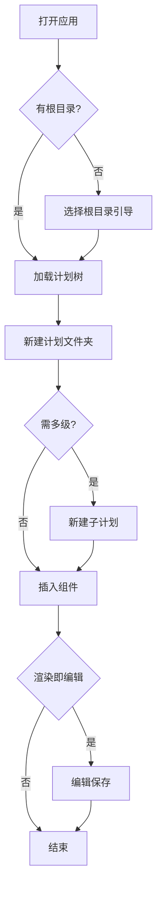
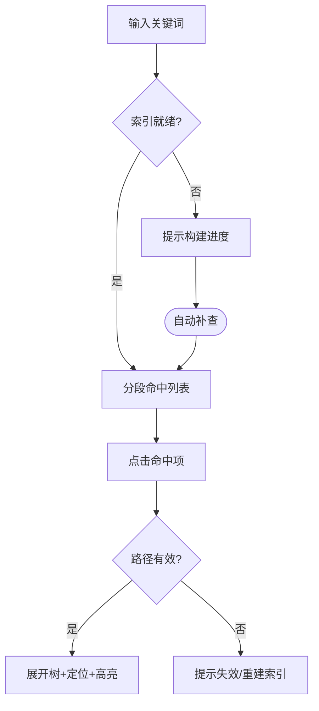

# 功能规格说明书 Functional Specification

## 文档信息 Document Information

| 项目 Item | 内容 Content |
|---------|-------------|
| 文档版本 Document Version | v1.0.0 |
| 创建日期 Created Date | 2026-09-05 |
| 最后修改 Last Modified | 2026-09-05 |
| 编制作者 Author | HeYS-Snowe |
| 对应PRD版本 PRD Version | v1.0.0 |

---

## 修改记录 Change History

| 版本 Version | 日期 Date | 修改人 Modifier | 审核人 Reviewer | 修改内容 Description |
|-------------|---------|---------------|---------------|-------------------|
| v1.0.0 | 2026-09-05 | HeYS-Snowe | HeYS-Snowe | 初始版本 Initial Version |

---

## 目录 Table of Contents

1. [概述 Overview](#1-概述-overview)
2. [功能架构 Function Architecture](#2-功能架构-function-architecture)
3. [功能详细规格 Functional Specifications](#3-功能详细规格-functional-specifications)
4. [用户交互流程 User Interaction Flows](#4-用户交互流程-user-interaction-flows)
5. [界面规范 Interface Specifications](#5-界面规范-interface-specifications)
6. [数据规格 Data Specifications](#6-数据规格-data-specifications)
7. [异常处理 Exception Handling](#7-异常处理-exception-handling)
8. [测试验收标准 Acceptance Criteria](#8-测试验收标准-acceptance-criteria)

---

## 1. 概述 Overview

### 1.1 文档目的 Document Purpose

本文档详细描述「溯源 Trace」v1.0 的功能规格，作为开发团队实现功能的依据，以及测试团队验证功能的参考。**组件行为定义为"按字面拟初稿"（本项目决策），评审冻结后生效；冻结前实现不得偏离本文档定义。**

### 1.2 适用范围 Scope

| 项目 Item | 说明 Description |
|---------|---------------|
| 产品名称 Product Name | 溯源 Trace（· by Qore） |
| 版本范围 Version Scope | v1.0 MVP |
| 模块范围 Module Scope | 存储模块、页面渲染模块、溯源查询模块（含公共能力） |

### 1.3 术语定义 Terminology

| 术语 Term | 定义 Definition |
|----------|---------------|
| 功能点 Feature Point | 最小的可独立实现和测试的功能单元（如：单选计划组件） |
| 用例 Use Case | 用户完成特定目标的交互序列 |
| 计划单片组件 | 内容最小单元：单选计划 / 多选计划 / 任务列表 / 任务详情 / 注释 |
| 渲染即编辑 | 组件常规态即内容展示态，点击进入编辑，无模式切换 |
| 存储格式契约 | 02 设计：目录 + 内容文件 + 元数据 + 格式版本号 |

---

## 2. 功能架构 Function Architecture

### 2.1 功能模块划分 Module Breakdown

```
┌─────────────────────────────────────────────────────────────┐
│                    溯源 Trace 产品系统                        │
├─────────────────────────────────────────────────────────────┤
│ ┌──────────────┐  ┌────────────────┐  ┌──────────────────┐ │
│ │ 存储模块      │  │ 页面渲染模块     │  │ 溯源查询模块       │ │
│ │ F-ST-001 根目录│  │ F-RN-001 单选   │  │ F-TR-001 关键词   │ │
│ │ F-ST-002 计划CR│  │ F-RN-002 多选   │  │ F-TR-002 来源回溯 │ │
│ │ F-ST-003 嵌套  │  │ F-RN-003 任务列 │  │                  │ │
│ │ F-ST-004 拖拽  │  │ F-RN-004 任务详 │  │                  │ │
│ │              │  │ F-RN-005 注释   │  │                  │ │
│ │              │  │ F-RN-006 编辑   │  │                  │ │
│ └──────────────┘  └────────────────┘  └──────────────────┘ │
│                                                             │
│ ┌─────────────────────────────────────────────────────────┐ │
│ │          公共模块 Common Modules                          │ │
│ │  文件服务 | 检索索引 | 渲染引擎 | 配置 | 日志 | 异常处理    │ │
│ └─────────────────────────────────────────────────────────┘ │
└─────────────────────────────────────────────────────────────┘
```

### 2.2 功能清单 Feature List

| 模块 Module | 功能 ID Feature ID | 功能名称 Feature Name | 优先级 Priority | 复杂度 Complexity |
|-----------|------------------|---------------------|---------------|------------------|
| 存储模块 Storage | F-ST-001 | 计划库根目录管理 | P0 | 低 |
| 存储模块 Storage | F-ST-002 | 计划文件夹创建/重命名/删除 | P0 | 低 |
| 存储模块 Storage | F-ST-003 | 嵌套结构（子计划） | P0 | 中 |
| 存储模块 Storage | F-ST-004 | 拖拽移动/排序 | P0 | 中 |
| 渲染模块 Rendering | F-RN-001 | 单选计划组件 | P0 | 中 |
| 渲染模块 Rendering | F-RN-002 | 多选计划组件 | P0 | 中 |
| 渲染模块 Rendering | F-RN-003 | 任务列表组件 | P0 | 中 |
| 渲染模块 Rendering | F-RN-004 | 任务详情组件 | P0 | 中 |
| 渲染模块 Rendering | F-RN-005 | 注释组件 | P0 | 低 |
| 渲染模块 Rendering | F-RN-006 | 组件内编辑（渲染即编辑） | P0 | 中 |
| 溯源模块 Trace | F-TR-001 | 关键词检索 | P0 | 中 |
| 溯源模块 Trace | F-TR-002 | 来源回溯定位 | P0 | 中 |
| 公共 Common | F-CM-001 | 本地日志与异常兜底 | P0 | 低 |

---

## 3. 功能详细规格 Functional Specifications

> **组件语义定义（草案，按字面拟初稿）：**
> - 单选计划：单一目标/单条主线的计划单片（"本期重点"），可勾选标记完成；
> - 多选计划：多个并列可选项的计划单片（"待办选择/可多线并行"），各项可独立勾选；
> - 任务列表：多条任务的集合（"周任务表"），每项含标题、状态、排序；
> - 任务详情：单条任务的完整信息（标题、描述、计划时间、状态、备注）；
> - 注释：自由文本备注块（复盘/心得/补充），附着于计划内任意位置。
> 各组件均遵循"渲染即编辑"（F-RN-006）。

### 3.1 存储模块：存储 Storage

#### F-ST-001：计划库根目录管理

**基本信息 Basic Information:**

| 属性 Attribute | 值 Value |
|-------------|---------|
| 功能 ID Feature ID | F-ST-001 |
| 功能名称 Feature Name | 计划库根目录管理 |
| 功能描述 Description | 首次启动选择/后续可切换数据根目录；根目录内规划计划库标准结构 |
| 用户角色 User Role | 个人用户（UR-001） |
| 优先级 Priority | P0 |
| 所属版本 Version | v1.0 |

**用例描述 Use Case Description:**

| 用例要素 Element | 内容 Content |
|--------------|-----------|
| 用例名称 Use Case Name | 配置计划库根目录 |
| 参与者 Actor | 用户 |
| 前置条件 Precondition | 应用已安装；无根目录（首次）或用户主动切换 |
| 后置条件 Postcondition | 根目录生效并持久化 |
| 触发条件 Trigger | 首次启动 / 设置内切换 |

**基本流程 Basic Flow:**

| 步骤 Step | 操作者 Actor | 操作描述 Action | 系统响应 System Response |
|----------|------------|---------------|----------------------|
| 1 | 用户 | 打开应用（无根目录） | 显示引导页，说明数据保存方式 |
| 2 | 用户 | 选择目标目录 | 校验是否可读写 |
| 3 | 系统 | - | 创建标准结构：根目录 + 元数据（`trace.config` + 格式版本号） |
| 4 | 系统 | - | 进入主界面，加载计划树 |

**备选流程 Alternative Flows:**

| 流程 Flow | 条件 Condition | 处理步骤 Steps |
|---------|--------------|--------------|
| Alt-1 切换根目录 | 已有根目录，用户切换 | 确认弹窗（提示不迁移数据）→ 校验 → 加载新树 → 旧数据保留在原处 |
| Alt-2 目录已有 trace.config | 重复选择已配置目录 | 直接加载，提示"已有计划库，直接打开" |

**异常流程 Exception Flows:**

| 异常 Exception | 条件 Condition | 处理方式 Handling |
|--------------|--------------|----------------|
| Exc-1 目录不可写 | 只读/权限不足 | 提示原因，引导换目录 |
| Exc-2 目录不存在 | 路径被删(切换后) | 启动时检测 → 提示恢复/重新选择，不删除数据 |

**业务规则 Business Rules:**

| 规则ID Rule ID | 规则描述 Rule Description |
|--------------|----------------------|
| BR-ST-001-1 | 根目录是计划树唯一根；根目录本身不视为计划 |
| BR-ST-001-2 | 切换根目录不迁移、不删除任何数据 |
| BR-ST-001-3 | 格式版本号记录于元数据，旧版本格式可读（兼容策略见 §6.2） |

**数据规格 Data Specification:**

| 数据项 Data Item | 类型 Type | 必填 Required | 验证规则 Validation |
|----------------|---------|------------|------------------|
| root_path | Path | 是 | 存在、可写、非应用安装目录自包含（防自嵌套） |
| format_version | String | 是 | 与程序支持版本匹配 |

**界面元素 UI Elements:**

| 元素 ID Element ID | 元素类型 Type | 标签 Label | 说明 Description |
|------------------|-------------|----------|----------------|
| E-ST-001-01 | 按钮 | 选择目录 | 打开系统目录选择器 |
| E-ST-001-02 | 文本段 | 数据说明 | "数据以明文件保存在所选目录，可随时备份" |
| E-ST-001-03 | 弹窗 | 确认切换 | 显示新旧路径与"不迁移"提示 |

**验收标准 Acceptance Criteria:**

- [ ] AC-001: 首次启动未选根目录不可进入主界面
- [ ] AC-002: 选择成功后在根目录可见 trace 标准结构（config + 约定子目录）
- [ ] AC-003: 切换根目录前后数据均保留完整

#### F-ST-002：计划文件夹创建/重命名/删除

**基本信息 Basic Information:**

| 属性 Attribute | 值 Value |
|-------------|---------|
| 功能 ID Feature ID | F-ST-002 |
| 功能名称 Feature Name | 计划文件夹创建/重命名/删除 |
| 功能描述 Description | 计划=文件夹：新建计划创建物理文件夹；重命名同步；删除含递归确认 |
| 用户角色 User Role | UR-001 |
| 优先级 Priority | P0 |
| 所属版本 Version | v1.0 |

**用例描述 Use Case Description:**

| 用例要素 Element | 内容 Content |
|--------------|-----------|
| 用例名称 Use Case Name | 计划生命周期（建/改/删） |
| 参与者 Actor | 用户 |
| 前置条件 Precondition | 根目录已配置 |
| 后置条件 Postcondition | 文件夹状态与 UI 一致 |
| 触发条件 Trigger | 新建/右键重命名/右键删除 |

**基本流程 Basic Flow:**

| 步骤 Step | 操作者 Actor | 操作描述 Action | 系统响应 System Response |
|----------|------------|---------------|----------------------|
| 1 | 用户 | 右键/工具栏"新建计划" | 内联输入名称 |
| 2 | 用户 | 输入名称回车 | 校验 → 创建物理文件夹 → 树中高亮新计划 |
| 3 | 用户 | 右键"重命名"与"删除" | 重命名=物理改名；删除=确认弹窗 |
| 4 | 系统 | - | 执行并刷新（重命名批量刷新索引 异步） |

**备选流程 Alternative Flows:**

| 流程 Flow | 条件 Condition | 处理步骤 Steps |
|---------|--------------|--------------|
| Alt-1 仅移动不改名 | 同目录拖拽重排 | 树内重排（见 F-ST-004） |

**异常流程 Exception Flows:**

| 异常 Exception | 条件 Condition | 处理方式 Handling |
|--------------|--------------|----------------|
| Exc-1 名称非法 | 含 `\ / : * ? " < > \|` | 即时提示非法字符 |
| Exc-2 重名冲突 | 同级重名 | 阻止并提示 |
| Exc-3 删除含内容 | 计划有子计划/内容 | 明确"递归删除不可恢复"，二次确认 |
| Exc-4 文件被外部工具占用/修改 | 磁盘变化 | 提示冲突并重载；不静默覆盖 |

**业务规则 Business Rules:**

| 规则ID Rule ID | 规则描述 Rule Description |
|--------------|----------------------|
| BR-ST-002-1 | 计划名非空、≤255 字符、非法字符禁止 |
| BR-ST-002-2 | 删除必须二次确认（v1.0 无撤销；v1.1 提供撤销补强） |

**数据规格 Data Specification:**

| 数据项 Data Item | 类型 Type | 必填 Required | 验证规则 Validation |
|----------------|---------|------------|------------------|
| plan_name | String | 是 | 非空/≤255/非法字符校验 |
| plan_path | Path | 是 | 唯一（物理路径） |
| created_at/updated_at | Date | 是 | 元数据文件维护 |

**界面元素 UI Elements:**

| 元素 ID Element ID | 元素类型 Type | 标签 Label | 说明 Description |
|------------------|-------------|----------|----------------|
| E-ST-002-01 | 树节点 | 计划名 | 右键菜单：新建子计划/重命名/删除/复制路径 |
| E-ST-002-02 | 内联输入框 | 计划名称 | 新建/重命名编辑态 |
| E-ST-002-03 | 确认弹窗 | 删除计划 | 含递归提示 |

**验收标准 Acceptance Criteria:**

- [ ] AC-001: 新建计划当场在磁盘可见对应文件夹
- [ ] AC-002: 重命名后磁盘文件夹名同步，索引异步刷新后检索结果更新
- [ ] AC-003: 粘贴非法名/超长名即时提示，不写入磁盘
- [ ] AC-004: 删除需经确认弹窗（无默认回车确认）

#### F-ST-003：嵌套结构（子计划）

**基本信息 Basic Information:**

| 属性 Attribute | 值 Value |
|-------------|---------|
| 功能 ID Feature ID | F-ST-003 |
| 功能名称 Feature Name | 嵌套结构（子计划） |
| 功能描述 Description | 计划文件夹可嵌套多级子计划；树支持展开/收起与面包屑 |
| 用户角色 User Role | UR-001 |
| 优先级 Priority | P0 |
| 所属版本 Version | v1.0 |

**用例描述 Use Case Description:**

| 用例要素 Element | 内容 Content |
|--------------|-----------|
| 用例名称 Use Case Name | 组织多级计划 |
| 参与者 Actor | 用户 |
| 前置条件 Precondition | 计划文件夹存在 |
| 后置条件 Postcondition | 层级结构可导航 |
| 触发条件 Trigger | 学期/项目周期组织计划 |

**基本流程 Basic Flow:**

| 步骤 Step | 操作者 Actor | 操作描述 Action | 系统响应 System Response |
|----------|------------|---------------|----------------------|
| 1 | 用户 | 选中计划右键"新建子计划" | 展开节点显示输入框 |
| 2 | 用户 | 输入名称回车 | 物理创建子文件夹并插入树 |
| 3 | 系统 | - | 树自动展开；面包屑更新 |
| 4 | 用户 | 折叠/展开父节点 | 保持内容区焦点不变 |

**异常流程 Exception Flows:**

| 异常 Exception | 条件 Condition | 处理方式 Handling |
|--------------|--------------|----------------|
| Exc-1 层级过深 | 路径长度接近上限 | 提示"层级已达上限（文件系统路径限制）"并阻止 |
| Exc-2 子计划名与既有冲突 | 同级同名 | 阻止并提示 |

**业务规则 Business Rules:**

| 规则ID Rule ID | 规则描述 Rule Description |
|--------------|----------------------|
| BR-ST-003-1 | 嵌套层级仅受文件系统路径长度限制（Windows 260 路径限制可启用长路径，02 定） |
| BR-ST-003-2 | 删除父计划 = 递归删除子计划（含确认） |

**验收标准 Acceptance Criteria:**

- [ ] AC-001: 3 级嵌套创建/收敛正常（样例：学期→课程→周计划）
- [ ] AC-002: 面包屑随导航实时更新，与树选中态一致
- [ ] AC-003: 深层路径提示限制而非静默失败

#### F-ST-004：拖拽移动/排序

**基本信息 Basic Information:**

| 属性 Attribute | 值 Value |
|-------------|---------|
| 功能 ID Feature ID | F-ST-004 |
| 功能名称 Feature Name | 拖拽移动/排序 |
| 功能描述 Description | 树节点拖拽：跨层级移动（改父子）、同层排序；含循环校验 |
| 用户角色 User Role | UR-001 |
| 优先级 Priority | P0 |
| 所属版本 Version | v1.0 |

**用例描述 Use Case Description:**

| 用例要素 Element | 内容 Content |
|--------------|-----------|
| 用例名称 Use Case Name | 调整计划秩序 |
| 参与者 Actor | 用户 |
| 前置条件 Precondition | 树已加载 |
| 后置条件 Postcondition | 结构符合用户预期；磁盘一致 |
| 触发条件 Trigger | 计划结构调整/学期切换 |

**基本流程 Basic Flow:**

| 步骤 Step | 操作者 Actor | 操作描述 Action | 系统响应 System Response |
|----------|------------|---------------|----------------------|
| 1 | 用户 | 拖起节点 | 半透明拖影 + 插入线/高亮目标 |
| 2 | 用户 | 悬停父节点 | 父节点预展开（延时阈值，02 定 ~600ms） |
| 3 | 用户 | 放置 | 校验循环/重名 → 物理移动 → 树刷新 |
| 4 | 系统 | - | 异步重建索引受影响片段 |

**备份流程 Alternative Flows:**

| 流程 Flow | 条件 Condition | 处理步骤 Steps |
|---------|--------------|--------------|
| Alt-1 同层排序 | 在同一父节点内放置 | 仅更新顺序元数据，不移动物理目录（顺序存储于元数据，02 契约细定） |

**异常流程 Exception Flows:**

| 异常 Exception | 条件 Condition | 处理方式 Handling |
|--------------|--------------|----------------|
| Exc-1 循环嵌套 | 目标为自身/子孙 | 放置点立即变红，放置被阻止 |
| Exc-2 跨盘符拖动 | 根目录在另一磁盘 | 建议使用"复制+移动"策略（02 定：跨盘移动能力 + 提示） |
| Exc-3 目标重名 | 放置后同名冲突 | 阻止放置并提示 |

**业务规则 Business Rules:**

| 规则ID Rule ID | 规则描述 Rule Description |
|--------------|----------------------|
| BR-ST-004-1 | 严禁把节点拖入自身或其后代（循环嵌套） |
| BR-ST-004-2 | 拖拽仅改变结构（轻量），复制到别处不在 v1.0 范围 |

**验收标准 Acceptance Criteria:**

- [ ] AC-001: 拖拽"计划 A → 计划 B 下"后磁盘路径变化可验证
- [ ] AC-002: 拖入自身/子孙被阻止（有视觉反馈）
- [ ] AC-003: 拖后索引 10s 内追上（异步刷新，02 定指标校准）

---

### 3.2 页面渲染模块：Rendering

#### F-RN-001：单选计划组件

**基本信息 Basic Information:**

| 属性 Attribute | 值 Value |
|-------------|---------|
| 功能 ID Feature ID | F-RN-001 |
| 功能名称 Feature Name | 单选计划组件 |
| 功能描述 Description | 单一目标计划单片：标题 + 完成勾选 + 摘要备注（草案语义） |
| 用户角色 User Role | UR-001 |
| 优先级 Priority | P0 |
| 所属版本 Version | v1.0 |

**用例描述 Use Case Description:**

| 用例要素 Element | 内容 Content |
|--------------|-----------|
| 用例名称 Use Case Name | 陈述"本期唯一重点"型计划 |
| 参与者 Actor | 用户 |
| 前置条件 Precondition | 计划文件夹存在 |
| 后置条件 Postcondition | 组件落盘（内容文件） |
| 触发条件 Trigger | 插入组件类型=单选计划 |

**基本流程 Basic Flow:**

| 步骤 Step | 操作者 Actor | 操作描述 Action | 系统响应 System Response |
|----------|------------|---------------|----------------------|
| 1 | 用户 | 插入"单选计划"组件 | 渲染默认卡片（标题输入 + 勾选框 + 摘要） |
| 2 | 用户 | 输入标题/摘要 | 实时保存（防抖 500ms） |
| 3 | 用户 | 勾选完成 | 完成态样式（划线/标记） |
| 4 | 系统 | - | 持久化，参与检索索引 |

**异常流程 Exception Flows:**

| 异常 Exception | 条件 Condition | 处理方式 Handling |
|--------------|--------------|----------------|
| Exc-1 空标题 | 未填标题 | 提示必填；不允许保存空（摘要可为空） |
| Exc-2 保存失败 | 磁盘 IO | 提示 + 内容保留在编辑态（同 F-RN-006） |

**业务规则 Business Rules:**

| 规则ID Rule ID | 规则描述 Rule Description |
|--------------|----------------------|
| BR-RN-001-1 | 单选计划语义：单条目标，字段=标题、完成态、摘要 |
| BR-RN-001-2 | 完成态仅影响展示样式，不推进其他状态 |

**验收标准 Acceptance Criteria:**

- [ ] AC-001: 可新建、编辑、删除单选计划组件
- [ ] AC-002: 勾选完成可反复（完成/取消）
- [ ] AC-003: 标题必填校验生效

#### F-RN-002：多选计划组件

**基本信息 Basic Information:**

| 属性 Attribute | 值 Value |
|-------------|---------|
| 功能 ID Feature ID | F-RN-002 |
| 功能名称 Feature Name | 多选计划组件 |
| 功能描述 Description | 多项并列可选项计划单片：标题 + 选项列表（可多选勾选）+ 摘要（草案语义） |
| 用户角色 User Role | UR-001 |
| 优先级 Priority | P0 |
| 所属版本 Version | v1.0 |

**用例描述 Use Case Description:**

| 用例要素 Element | 内容 Content |
|--------------|-----------|
| 用例名称 Use Case Name | 陈述"并行多线/待选择"型计划 |
| 参与者 Actor | 用户 |
| 前置条件 Precondition | 计划文件夹存在 |
| 后置条件 Postcondition | 选项与勾选态落盘 |
| 触发条件 Trigger | 插入组件类型=多选计划 |

**基本流程 Basic Flow:**

| 步骤 Step | 操作者 Actor | 操作描述 Action | 系统响应 System Response |
|----------|------------|---------------|----------------------|
| 1 | 用户 | 插入"多选计划"组件 | 渲染卡片（标题 + 选项数组） |
| 2 | 用户 | 添加/修改选项 | 选项行新增/删除 |
| 3 | 用户 | 勾选若干选项 | 勾选态实时保存 |
| 4 | 系统 | - | 持久化 + 索引 |

**异常流程 Exception Flows:**

| 异常 Exception | 条件 Condition | 处理方式 Handling |
|--------------|--------------|----------------|
| Exc-1 空选项 | 选项留空 | 阻止保存空行 |
| Exc-2 同选项重复 | 文本重复 | 提示重复 |

**业务规则 Business Rules:**

| 规则ID Rule ID | 规则描述 Rule Description |
|--------------|----------------------|
| BR-RN-002-1 | 多选计划语义：n 个可选项、任意勾选、可统计"已选 x/n" |
| BR-RN-002-2 | 选项顺序可拖动调整 |

**验收标准 Acceptance Criteria:**

- [ ] AC-001: 多选项增删改 + 独立勾选正常
- [ ] AC-002: 已有勾选统计展示
- [ ] AC-003: 选项重排保持已勾选状态

#### F-RN-003：任务列表组件

**基本信息 Basic Information:**

| 属性 Attribute | 值 Value |
|-------------|---------|
| 功能 ID Feature ID | F-RN-003 |
| 功能名称 Feature Name | 任务列表组件 |
| 功能描述 Description | 多条任务的集合：每项 = 标题 + 三态（未开始/进行中/完成）+ 排序（草案语义） |
| 用户角色 User Role | UR-001 |
| 优先级 Priority | P0 |
| 所属版本 Version | v1.0 |

**用例描述 Use Case Description:**

| 用例要素 Element | 内容 Content |
|--------------|-----------|
| 用例名称 Use Case Name | "本周任务表"型计划内容 |
| 参与者 Actor | 用户 |
| 前置条件 Precondition | 计划文件夹存在 |
| 后置条件 Postcondition | 任务状态与顺序落盘 |
| 触发条件 Trigger | 插入组件类型=任务列表 |

**基本流程 Basic Flow:**

| 步骤 Step | 操作者 Actor | 操作描述 Action | 系统响应 System Response |
|----------|------------|---------------|----------------------|
| 1 | 用户 | 插入"任务列表"组件 | 渲染列表（空态提示"添加任务"） |
| 2 | 用户 | 添加任务（标题 + 可选计划时间） | 任务行生成，默认未开始 |
| 3 | 用户 | 点击状态切换 | 三态轮换（未开始→进行中→完成→进行中→…含回退） |
| 4 | 系统 | - | 完成时记录 completed_at；持久化 |

**异常流程 Exception Flows:**

| 异常 Exception | 条件 Condition | 处理方式 Handling |
|--------------|--------------|----------------|
| Exc-1 空标题任务 | - | 阻止提交空行 |
| Exc-2 批量状态（远期） | v1.1 | - |

**业务规则 Business Rules:**

| 规则ID Rule ID | 规则描述 Rule Description |
|--------------|----------------------|
| BR-RN-003-1 | 任务项三态机：未开始↔进行中↔完成（可回退，完成记录时间） |
| BR-RN-003-2 | 逾期为展示层计算（计划时间早于今天且未完成），不写入数据 |
| BR-RN-003-3 | 任务行可拖动排序 |

**验收标准 Acceptance Criteria:**

- [ ] AC-001: 增删改任务、状态三态切换、完成时间记录正常
- [ ] AC-002: 逾期标记按规则显示（=计划时间已过且未完成）
- [ ] AC-003: 任务排序可拖动且保存

#### F-RN-004：任务详情组件

**基本信息 Basic Information:**

| 属性 Attribute | 值 Value |
|-------------|---------|
| 功能 ID Feature ID | F-RN-004 |
| 功能名称 Feature Name | 任务详情组件 |
| 功能描述 Description | 单条任务的完整信息卡：标题 + 描述 + 计划时间 + 状态 + 备注（草案语义） |
| 用户角色 User Role | UR-001 |
| 优先级 Priority | P0 |
| 所属版本 Version | v1.0 |

**用例描述 Use Case Description:**

| 用例要素 Element | 内容 Content |
|--------------|-----------|
| 用例名称 Use Case Name | 单任务详述型内容 |
| 参与者 Actor | 用户 |
| 前置条件 Precondition | 计划文件夹存在 |
| 后置条件 Postcondition | 完整任务信息落盘 |
| 触发条件 Trigger | 插入组件类型=任务详情 |

**基本流程 Basic Flow:**

| 步骤 Step | 操作者 Actor | 操作描述 Action | 系统响应 System Response |
|----------|------------|---------------|----------------------|
| 1 | 用户 | 插入"任务详情"组件 | 渲染详情卡（标题/描述/计划时间/状态/备注） |
| 2 | 用户 | 填写各字段 | 即时保存（防抖） |
| 3 | 用户 | 状态切换 | 同三态规则 |
| 4 | 系统 | - | 持久化 + 索引（标题/描述/备注参与检索） |

**异常流程 Exception Flows:**

| 异常 Exception | 条件 Condition | 处理方式 Handling |
|--------------|--------------|----------------|
| Exc-1 时间格式错误 | 计划时间非法 | 校验提示（日期选择器规避） |
| Exc-2 空标题 | - | 拒绝保存 |

**业务规则 Business Rules:**

| 规则ID Rule ID | 规则描述 Rule Description |
|--------------|----------------------|
| BR-RN-004-1 | 任务详情=单个任务的完整描述（区别于任务列表的行项） |
| BR-RN-004-2 | 描述支持多行文本（无 markdown 渲染，纯文本+换行，v1.0） |

**验收标准 Acceptance Criteria:**

- [ ] AC-001: 五个字段输入/展示正确
- [ ] AC-002: 状态切换与 completed_at 联动
- [ ] AC-003: 该组件内容可被检索命中

#### F-RN-005：注释组件

**基本信息 Basic Information:**

| 属性 Attribute | 值 Value |
|-------------|---------|
| 功能 ID Feature ID | F-RN-005 |
| 功能名称 Feature Name | 注释组件 |
| 功能描述 Description | 自由文本备注块：复盘/心得/补充说明，可附着于计划（草案语义） |
| 用户角色 User Role | UR-001 |
| 优先级 Priority | P0 |
| 所属版本 Version | v1.0 |

**用例描述 Use Case Description:**

| 用例要素 Element | 内容 Content |
|--------------|-----------|
| 用例名称 Use Case Name | 计划复盘备注 |
| 参与者 Actor | 用户 |
| 前置条件 Precondition | 计划文件夹存在 |
| 后置条件 Postcondition | 注释落盘并参与索引 |
| 触发条件 Trigger | 插入组件类型=注释 |

**基本流程 Basic Flow:**

| 步骤 Step | 操作者 Actor | 操作描述 Action | 系统响应 System Response |
|----------|------------|---------------|----------------------|
| 1 | 用户 | 插入"注释"组件 | 渲染引用块样式输入区 |
| 2 | 用户 | 输入文本 | 实时保存（防抖） |
| 3 | 系统 | - | 持久化；内容进入检索索引 |
| 4 | 用户 | 复盘期重读 | 正常渲染（样式区别于正文） |

**异常流程 Exception Flows:**

| 异常 Exception | 条件 Condition | 处理方式 Handling |
|--------------|--------------|----------------|
| Exc-1 超长内容 | >20000 字符 | 限制并提示 |

**业务规则 Business Rules:**

| 规则ID Rule ID | 规则描述 Rule Description |
|--------------|----------------------|
| BR-RN-005-1 | 注释是"经验沉淀"入口：内容必须参与检索（否则溯源断一臂） |
| BR-RN-005-2 | 样式为引用块/弱化背景，与任务类组件区分 |

**验收标准 Acceptance Criteria:**

- [ ] AC-001: 长文本（多行）输入/渲染/换行正确
- [ ] AC-002: 注释内容可检索命中并可回溯（F-TR-002）
- [ ] AC-003: 组件样式与其他组件可区分

#### F-RN-006：组件内编辑（渲染即编辑）

**基本信息 Basic Information:**

| 属性 Attribute | 值 Value |
|-------------|---------|
| 功能 ID Feature ID | F-RN-006 |
| 功能名称 Feature Name | 组件内编辑（渲染即编辑） |
| 功能描述 Description | 点击组件即编辑（无编辑模式切换、无 markdown 语法），编辑即保存 |
| 用户角色 User Role | UR-001 |
| 优先级 Priority | P0 |
| 所属版本 Version | v1.0 |

**用例描述 Use Case Description:**

| 用例要素 Element | 内容 Content |
|--------------|-----------|
| 用例名称 Use Case Name | 修改计划内容 |
| 参与者 Actor | 用户 |
| 前置条件 Precondition | 组件已渲染 |
| 后置条件 Postcondition | 编辑内容落盘 |
| 触发条件 Trigger | 点击/双击组件任意编辑区 |

**基本流程 Basic Flow:**

| 步骤 Step | 操作者 Actor | 操作描述 Action | 系统响应 System Response |
|----------|------------|---------------|----------------------|
| 1 | 用户 | 点击组件字段 | 进入编辑态（输入光标 + 编辑样式） |
| 2 | 用户 | 修改内容 | 防抖保存（500ms 静默写盘） |
| 3 | 用户 | 失焦/回车/ESC | 退出编辑态（ESC 放弃本笔，其余已完成行保留） |
| 4 | 系统 | - | 渲染新态 + 状态栏"已保存" |

**异常流程 Exception Flows:**

| 异常 Exception | 条件 Condition | 处理方式 Handling |
|--------------|--------------|----------------|
| Exc-1 保存失败 | IO/只读 | 保留编辑态 + 顶部提示失败 → 重试按钮 |
| Exc-2 应用崩溃 | 保存中 | 写盘原子（临时文件+rename，02 约束）：崩溃不产生半写文件 |

**业务规则 Business Rules:**

| 规则ID Rule ID | 规则描述 Rule Description |
|--------------|----------------------|
| BR-RN-006-1 | "渲染即编辑"：五类组件均遵循；删/插组件类操作通过组内工具栏 |
| BR-RN-006-2 | ESC 还原语义：仅还原当前未提交行；已落盘内容不滚回 |

**验收标准 Acceptance Criteria:**

- [ ] AC-001: 编辑保存 ≤ 500ms（含防抖）无感
- [ ] AC-002: 崩溃恢复后无半写文件（模拟拔电/进程杀测试）
- [ ] AC-003: 编辑互不干扰（局部刷新，无整篇闪烁）

---

### 3.3 溯源查询模块：Trace & Search

#### F-TR-001：关键词检索

**基本信息 Basic Information:**

| 属性 Attribute | 值 Value |
|-------------|---------|
| 功能 ID Feature ID | F-TR-001 |
| 功能名称 Feature Name | 关键词检索 |
| 功能描述 Description | 本地索引检索：计划名/任务标题与内容/注释内容；多词 AND；结果分段 |
| 用户角色 User Role | UR-001 |
| 优先级 Priority | P0 |
| 所属版本 Version | v1.0 |

**用例描述 Use Case Description:**

| 用例要素 Element | 内容 Content |
|--------------|-----------|
| 用例名称 Use Case Name | 溯源检索 |
| 参与者 Actor | 用户 |
| 前置条件 Precondition | 索引就绪（启动增量构建，首次全量） |
| 后置条件 Postcondition | 命中列表已展示 |
| 触发条件 Trigger | 顶栏输入关键词（防抖 300ms） |

**基本流程 Basic Flow:**

| 步骤 Step | 操作者 Actor | 操作描述 Action | 系统响应 System Response |
|----------|------------|---------------|----------------------|
| 1 | 用户 | 顶栏输入关键词 | 展示下拉结果（计划/任务/注释 分段） |
| 2 | 系统 | - | 索引查询 → 分段列表（显示命中字段 + 所属计划路径） |
| 3 | 用户 | 展开/点击（→ F-TR-002） | 定位 |
| 4 | 系统 | - | 结果排序：计划名优先 → 任务 → 注释（相关性简版，02 优化） |

**异常流程 Exception Flows:**

| 异常 Exception | 条件 Condition | 处理方式 Handling |
|--------------|--------------|----------------|
| Exc-1 索引构建中 | 首次启动/大规模变更后 | 提示"索引构建中 x%"，完成后自动刷新结果 |
| Exc-2 无命中 | - | 空态：建议换词 |
| Exc-3 索引与磁盘不一致 | 外部改动文件 | 提示"计划库有外部变更"→ 手动重建索引（02 设计提示时机） |

**业务规则 Business Rules:**

| 规则ID Rule ID | 规则描述 Rule Description |
|--------------|----------------------|
| BR-TR-001-1 | 检索范围=计划名/任务（标题+描述+备注）/注释；命中=包含（不区分大小写，中文按字面） |
| BR-TR-001-2 | 多词 = AND；结果含高亮命中片段 |
| BR-TR-001-3 | 响应 ≤ 1s（1000 计划/10000 任务规模） |

**验收标准 Acceptance Criteria:**

- [ ] AC-001: 三类内容均可达（计划/任务/注释 抽样各 ≥ 10 条）
- [ ] AC-002: 规模上限内性能 ≤ 1s
- [ ] AC-003: 结果路径显示正确（含嵌套层级）

#### F-TR-002：来源回溯定位

**基本信息 Basic Information:**

| 属性 Attribute | 值 Value |
|-------------|---------|
| 功能 ID Feature ID | F-TR-002 |
| 功能名称 Feature Name | 来源回溯定位 |
| 功能描述 Description | 命中项 → 打开所属计划 → 树路径展开 → 定位高亮组件/任务 |
| 用户角色 User Role | UR-001 |
| 优先级 Priority | P0 |
| 所属版本 Version | v1.0 |

**用例描述 Use Case Description:**

| 用例要素 Element | 内容 Content |
|--------------|-----------|
| 用例名称 Use Case Name | 从命中回到源头 |
| 参与者 Actor | 用户 |
| 前置条件 Precondition | 检索命中列表存在 |
| 后置条件 Postcondition | 用户看到命中项所在的计划与上下文 |
| 触发条件 Trigger | 点击命中项 |

**基本流程 Basic Flow:**

| 步骤 Step | 操作者 Actor | 操作描述 Action | 系统响应 System Response |
|----------|------------|---------------|----------------------|
| 1 | 用户 | 点击命中项 | 定位组件（跳转并滚动） |
| 2 | 系统 | - | 展开计划树路径 + 打开内容 + 高亮命中组件（2-3s 渐隐） |
| 3 | 系统 | - | 面包屑更新、搜索框收起 |
| 4 | 用户 | - | 上下文确认（"源头找到了"） |

**异常流程 Exception Flows:**

| 异常 Exception | 条件 Condition | 处理方式 Handling |
|--------------|--------------|----------------|
| Exc-1 计划被移动/删除 | 外部或应用内变化 | 提示"结果已失效，将尝试重定位"，失败则仅展示路径文本 |
| Exc-2 组件已不在 | 内容变更 | 打开计划 + 提示未定位到组件 |

**业务规则 Business Rules:**

| 规则ID Rule ID | 规则描述 Rule Description |
|--------------|----------------------|
| BR-TR-002-1 | 回溯是"跳到源头"，不是复制内容 |
| BR-TR-002-2 | 路径展示采用相对根目录路径（便于移机） |

**验收标准 Acceptance Criteria:**

- [ ] AC-001: 命中项点击后树展开 + 内容定位 + 高亮 三者同时可达
- [ ] AC-002: 计划被移动（应用内）后索引 10s 内自愈；外部移动则提示重建
- [ ] AC-003: 定位上下文（计划名/路径）可见

---

### 3.4 公共模块：Common

#### F-CM-001：本地日志与异常兜底

**基本信息 Basic Information:**

| 属性 Attribute | 值 Value |
|-------------|---------|
| 功能 ID Feature ID | F-CM-001 |
| 功能名称 Feature Name | 本地日志与异常兜底 |
| 功能描述 Description | 应用本地日志（脱敏，不含计划正文）；崩溃/异常不损数据 |
| 用户角色 User Role | 系统 |
| 优先级 Priority | P0 |
| 所属版本 Version | v1.0 |

**基本流程 Basic Flow:**

| 步骤 Step | 操作者 Actor | 操作描述 Action | 系统响应 System Response |
|----------|------------|---------------|----------------------|
| 1 | 系统 | 运行期产生异常 | 记录（异常类型/模块/时间栈；脱敏）到 `logs/` |
| 2 | 系统 | - | 界面友好提示 + 数据保障（原子写） |
| 3 | 用户 | - | 可导出日志协助排查（本期自用；"日志不含计划全文"为硬规则） |

**验收标准 Acceptance Criteria:**

- [ ] AC-001: 日志文件存在且不含计划正文（抽样验证脱敏）
- [ ] AC-002: 模拟 IO 失败/崩溃后重启，数据完整可读
- [ ] AC-003: 异常只影响当前操作，不拖垮应用（兜底恢复）

---

## 4. 用户交互流程 User Interaction Flows

### 4.1 核心交互流程 Core Interaction Flows

#### 流程1：计划创建与组织

**流程图 Flowchart:**



**流程描述 Flow Description:**

| 步骤 Step | 页面/屏幕 Page/Screen | 操作 Action | 说明 Notes |
|----------|---------------------|-----------|----------|
| 1 | 启动页 | 配置根目录 | 首次必配 |
| 2 | 主界面 | 新建/嵌套/拖拽 | 结构即文件夹树 |
| 3 | 主界面 | 插入 5 类组件 | 内容单元 |
| 4 | 主界面 | 点击编辑 | 渲染即编辑 |

#### 流程2：溯源查询

**流程图 Flowchart:**



**流程描述 Flow Description:**

| 步骤 Step | 页面/屏幕 Page/Screen | 操作 Action | 说明 Notes |
|----------|---------------------|-----------|----------|
| 1 | 主界面顶栏 | 输入关键词 | 防抖 300ms |
| 2 | 下拉/结果区 | 查看命中 | 分段展示 |
| 3 | 主界面 | 点击回溯 | 高亮定位 |

---

## 5. 界面规范 Interface Specifications

### 5.1 页面布局规范 Page Layout Specifications

#### 页面1：主界面（计划库）

**页面信息 Page Information:**

| 属性 Attribute | 值 Value |
|-------------|---------|
| 页面 ID Page ID | P-001 |
| 页面名称 Page Name | 主界面（计划库） |
| 页面类型 Page Type | 列表页 + 内容区（双栏） |
| 访问权限 Access | 单用户（本地） |

**布局结构 Layout Structure:**

```
┌────────────────────────────────────────────────────┐
│        溯源 Trace        全局搜索框        [新建计划] │  顶栏
├──────────────┬─────────────────────────────────────┤
│  计划树        │   内容区（当前计划）                 │
│  └ 学期计划    │   ┌ 单选计划组件 ───────────┐       │
│     └ 课程    │   │ 目标: xxx   ☑完成       │       │
│  └ 项目计划    │   └────────────────────────┘       │
│  └ 生活计划    │   ┌ 任务列表组件 ───────────┐       │
│              │   │ [x] 任务A  [→] 任务B      │      │
│              │   └────────────────────────┘       │
├──────────────┴─────────────────────────────────────┤
│ 状态栏：索引状态 | 保存状态 | 根目录路径              │
└────────────────────────────────────────────────────┘
```

**页面元素清单 Page Elements:**

| 元素ID Element ID | 元素名称 Element Name | 类型 Type | 位置 Position | 属性 Properties |
|-----------------|---------------------|---------|--------------|---------------|
| E-P001-01 | 计划树 | 树控件 | 左栏 | 可展开/收起、右键菜单、拖拽 |
| E-P001-02 | 内容区 | 渲染容器 | 右栏 | 组件序列渲染、空态 |
| E-P001-03 | 全局搜索框 | 输入框 | 顶栏 | 聚焦即弹出结果 |
| E-P001-04 | 新建计划 | 按钮 | 顶栏 | 内联命名 |
| E-P001-05 | 状态栏 | 文本 | 底部 | 索引/保存状态 |

**交互说明 Interaction:**

| 元素 Element | 事件 Event | 行为 Behavior |
|------------|----------|-------------|
| 计划树节点 | 点击/右键/拖拽 | 选中导航 / 菜单 / 结构与排序 |
| 组件区 | 点击字段 | 进入编辑态 |
| 搜索框 | 输入/ESC | 实时检索 / 清空收起 |

#### 页面2：溯源查询结果页

**页面信息 Page Information:**

| 属性 Attribute | 值 Value |
|-------------|---------|
| 页面 ID Page ID | P-002 |
| 页面名称 Page Name | 溯源查询结果 |
| 页面类型 Page Type | 列表页（下拉/浮层） |
| 访问权限 Access | 单用户 |

**页面元素清单 Page Elements:**

| 元素ID Element ID | 元素名称 Element Name | 类型 Type | 位置 Position | 属性 Properties |
|-----------------|---------------------|---------|--------------|---------------|
| E-P002-01 | 结果分段（计划/任务/注释） | 分组列表 | 搜索框下方 | 每项含类型徽标 + 路径 |
| E-P002-02 | 命中片段 | 文本 | 结果项内 | 高亮关键词 |
| E-P002-03 | 空态提示 | 文本 | 无结果时 | "未命中，试试更短关键词" |

#### 页面3：首次启动引导

**页面信息 Page Information:**

| 属性 Attribute | 值 Value |
|-------------|---------|
| 页面 ID Page ID | P-003 |
| 页面名称 Page Name | 首次启动引导 |
| 页面类型 Page Type | 表单页（一次性） |
| 访问权限 Access | 单用户 |

**页面元素清单 Page Elements:**

| 元素ID Element ID | 元素名称 Element Name | 类型 Type | 位置 Position | 属性 Properties |
|-----------------|---------------------|---------|--------------|---------------|
| E-P003-01 | 数据说明 | 文本段 | 居中 | 标题"计划有迹可循"+ 明文件说明 |
| E-P003-02 | 选择目录 | 按钮 | 文本下方 | 打开目录选择器 |
| E-P003-03 | 路径回显 | 文本 | 选择后 | 校验结果（可写/已存在） |

### 5.2 组件规范 Component Specifications

| 组件名称 Component | 使用场景 Usage | 状态 States | 属性 Properties | 事件 Events |
|------------------|--------------|-----------|---------------|-----------|
| 计划树节点 | 计划层级导航 | 展开/收起/选中/拖拽中 | 名称、图标（计划/子计划）、子节点 | 点击/展开/右键/拖放 |
| 组件卡片（5 类） | 计划内容单元 | 渲染态/编辑态/完成态 | type、payload | 点击编辑、同步变更 |
| 内联输入框 | 新建/重命名/编辑 | 编辑/校验错误 | 值、校验 | 回车提交、失焦保存 |
| 确认弹窗 | 删除/切换根目录 | 打开/关闭 | 文案（含不可恢复提示） | 确认/取消 |
| 搜索下拉 | 溯源检索 | 触发/加载/空 | 分段结果 | 输入/ESC/点击 |

### 5.3 响应式设计 Responsive Design

> 桌面单窗口应用。窗口宽度基线：

| 断点 Breakpoint | 窗口宽度 Screen Width | 布局调整 Layout Change |
|--------------|---------------------|----------------------|
| 窄窗口 Narrow | < 960px | 树可折叠为抽屉（顶栏按钮唤起） |
| 标准 Standard | ≥ 960px | 双栏（树 280px + 内容区自适应） |

---

## 6. 数据规格 Data Specifications

> v1.0 无数据库；物理存储=明文件（目录 + 内容文件 + 元数据 + 格式版本号），契约以 02 设计发布为准。下表为逻辑规格（契约的上位约束）。

### 6.1 数据实体规格 Entity Specifications

#### 实体1：计划 Plan（=文件夹）

**实体属性 Entity Attributes:**

| 字段名 Field | 数据类型 Type | 长度 Length | 默认值 Default | 必填 Required | 唯一 Unique | 索引 Index | 说明 Description |
|------------|-------------|----------|-------------|------------|-----------|----------|---------------|
| id | String（相对路径） | - | - | 是 | 是 | 主键 | 相对根目录 |
| name | String | ≤255 | - | 是 | 同级 | 树 | 物理文件夹名 |
| parent_id | String | - | null | 否 | - | 树 | 父路径 |
| order | Number | - | 末位 | 是 | - | - | 同层排序 |
| created_at / updated_at | Date | - | now | 是 | - | - | 元数据文件 |

**关系 Relationships:**

| 关系类型 Relationship Type | 目标实体 Target Entity | 外键字段 Foreign Key | 级联规则 Cascade |
|----------------------|---------------------|-------------------|---------------|
| 一对多 1:N | 子计划 | parent_id | 删除父 = 递归删除子 |
| 一对多 1:N | 组件 | plan_id（内容文件归属） | 随计划删除 |
| 一对多 1:N | 注释（组件的用途） | 所属组件/计划 | 随删除 |

#### 实体2：组件 Component

**实体属性 Entity Attributes（片段）:**

| 字段名 Field | 数据类型 Type | 长度 Length | 默认值 Default | 必填 Required | 唯一 Unique | 索引 Index | 说明 Description |
|------------|-------------|----------|-------------|------------|-----------|----------|---------------|
| id | String | - | - | 是 | 是 | - | 组件标识 |
| type | String（枚举） | - | - | 是 | - | 检索 | single_plan/multi_plan/task_list/task_detail/note |
| title | String | ≤200 | - | 视类型 | - | 检索 | 多数组件有标题（注释除外） |
| payload | 类型化 JSON | - | - | 是 | - | - | 类型相关内容 |

#### 实体3：任务 Task

**实体属性 Entity Attributes（片段）:**

| 字段名 Field | 数据类型 Type | 长度 Length | 默认值 Default | 必填 Required | 唯一 Unique | 索引 Index | 说明 Description |
|------------|-------------|----------|-------------|------------|-----------|----------|---------------|
| id | String | - | - | 是 | 是 | - | - |
| title | String | ≤200 | - | 是 | - | 检索 | - |
| status | String（枚举） | - | not_started | 是 | - | 检索/筛选 | not_started/in_progress/done |
| planned_at | Date | - | null | 否 | - | - | 逾期展示层判定 |
| completed_at | Date | - | null | 否 | - | - | 状态机写入 |
| note | String | - | - | 否 | - | 检索 | 任务描述/备注 |

### 6.2 接口数据规格 API Data Specifications

> v1.0 无网络接口。内部约定的"检索/存储/渲染"服务契约见 PRD §7；以下为存储格式契约的**约束级规格**（详细格式=02 交付）：

| 项目 Item | 值 Value |
|----------|---------|
| 接口路径 Path | 计划库根目录（文件系统） |
| 请求方法 Method | 文件读写（含原子写：临时文件 + rename） |
| 内容类型 Content-Type | 格式契约（02）：单计划 = 文件夹；内容 = 组件序列文件 + 元数据文件 + 格式版本号 |

**成功响应 Success Response (示意，02 细化):**

```json
{
  "format_version": 1,
  "plan": { "name": "2026-A 学期", "order": 0, "created_at": "2026-09-05" },
  "components": [ {"id":"c1","type":"task_list","payload":{"items":[...]}} ]
}
```

**错误响应 Error Response (示意，02 细化):**

```json
{ "code": 14, "message": "格式损坏（组件降级渲染）" }
```

### 6.3 数据验证规则 Data Validation Rules

| 字段 Field | 验证类型 Validation Type | 规则 Rule | 错误消息 Error Message |
|----------|----------------------|---------|---------------------|
| plan.name | 必填/格式/长度 | 非空、≤255、无非法字符 | "名称不能为空/超长/含非法字符" |
| task.title | 必填/长度 | ≤200 | "任务标题不能为空" |
| task.status | 枚举 | 三态 | "无效状态" |
| note.content | 长度 | ≤20000 | "注释过长" |
| root_path | 存在/可写 | 目录校验 | "目录不可用，请重选" |

---

## 7. 异常处理 Exception Handling

### 7.1 异常场景分类 Exception Categories

| 异常类型 Exception Type | 处理策略 Handling Strategy |
|----------------------|----------------------|
| 目录/文件异常（不存在/只读/被占用） | 提示原因 + 提供重试/重定位；不静默写入 |
| 数据格式异常（未知组件/损坏文件） | 降级为占位块显示，不崩溃；日志记录（脱敏） |
| 保存失败（IO） | 内容保留编辑态 + 重试按钮 |
| 外部变更冲突（目录被外部工具改） | 提示 + 重载/重建索引选项 |
| 索引未就绪 | 提示进度，完成后自动补查 |
| 应用崩溃 | 原子写保证无半写；重启自检（根目录完整性提示） |

### 7.2 错误代码规范 Error Code Specification

| 错误码 Error Code | 类型 Type | 用户消息 User Message |
|-----------------|-----------|-------------------|
| 10 | 路径不存在 | "目标位置不存在，可能已被移动或删除" |
| 11 | 无权限/只读 | "目录只读或无权限，请检查系统权限" |
| 12 | 重名冲突 | "同名文件夹已存在，请换一个名称" |
| 13 | 循环嵌套 | "不能把计划移动到它自己或它的子计划中" |
| 14 | 格式损坏 | "该内容格式异常，已降级显示；可在源码中查看" |
| 15 | 保存失败 | "保存失败，请重试；内容已保留，不会丢失" |

### 7.3 异常处理流程 Exception Handling Flow

```
异常发生
  ↓
记录日志（脱敏，不含计划全文）Log Error
  ↓
判断异常类型 Check Type
  ↓
├─ 可恢复 Recoverable（IO/路径/权限/重名） → 明确提示 + 重试/换路径
└─ 不可恢复 Unrecoverable（格式损坏） → 降级显示 + 数据保护（原子写，绝不截断原文件）
```

---

## 8. 测试验收标准 Acceptance Criteria

### 8.1 功能测试标准 Functional Testing Criteria

| 功能 Feature | 测试场景 Test Scenario | 预期结果 Expected Result | 优先级 Priority |
|------------|---------------------|----------------------|---------------|
| F-ST-001 | 正常流程（首次配置/切换） | 引导、校验、持久化全通 | P0 |
| F-ST-001 | 切换根目录 | 二次确认；旧数据保留 | P0 |
| F-ST-002 | 计划 CRUD | 磁盘与 UI 一致 | P0 |
| F-ST-002 | 非法名/重名 | 即时提示，不落盘 | P0 |
| F-ST-003 | 3 级嵌套 + 面包屑 | 导航一致 | P0 |
| F-ST-004 | 拖拽（含循环/重名） | 物理移动正确；阻止合法 | P0 |
| F-RN-001~005 | 5 类组件渲染/编辑 | 按草案语义稳定可用 | P0 |
| F-RN-006 | 保存/失败重试/崩溃安全 | ≤500ms；无半写 | P0 |
| F-TR-001 | 检索性能/覆盖 | ≤1s；无漏检（抽样） | P0 |
| F-TR-002 | 回溯定位 | 树/内容/高亮三者一致 | P0 |

### 8.2 非功能测试标准 Non-Functional Testing Criteria

| 测试类型 Test Type | 测试项 Test Item | 标准 Standard | 测试方法 Method |
|-----------------|----------------|-------------|---------------|
| 性能测试 Performance | 冷启动/操作响应/检索 | <3s / <1s / ≤1s | 计时（测试脚本） |
| 兼容性测试 Compatibility | Windows 10/11（及选型扩展平台） | 目标平台可用 | 平台矩阵 |
| 安全测试 Security | 数据不外出（无网络调用） | 无网络请求 | 抓包/网络列表审计 |
| 数据测试 Data | 崩溃/跳过写盘 | 无半写、无丢数据 | 异常注入测试 |
| 备份测试 Data | 整库拷贝恢复 | 拷贝即可用 | 备份演练 |

### 8.3 验收检查清单 Acceptance Checklist

**功能验收 Functional:**

- [ ] 所有P0功能正常工作（F-ST/F-RN/F-TR 12 项）
- [ ] 所有P1功能正常工作（v1.0 无 P1 必达项——撤销/筛选延至 v1.1）
- [ ] 异常场景正确处理（§7 异常分类全覆盖）
- [ ] 数据验证正确执行（§6.3 规则全通）
- [ ] 业务规则正确应用（BR-* 全通）

**界面验收 UI:**

- [ ] 页面布局正确（P-001 主界面/搜索结果/首次引导）
- [ ] 窗口缩放/窄窗口抽屉可用
- [ ] 编辑反馈及时（状态栏保存状态）
- [ ] 错误提示清晰（含中文文案与重试）

**数据验收 Data:**

- [ ] 数据保存完整（组件序列不丢）
- [ ] 数据读取正确（重启后一致）
- [ ] 数据一致性保持（与磁盘明文件核对）
- [ ] 数据安全保护（无网络上传；标题/内容不落入日志）

---

## 附录 Appendix

### 附录A：功能优先级定义 Priority Definition

| 优先级 Priority | 定义 Definition | 示例 Example |
|--------------|--------------|------------|
| P0 | 必须有，否则无法发布 Must Have | 存储/渲染/溯源查询三模块 12 项功能 |
| P1 | 应该有，影响用户体验 Should Have | 撤销/还原、高级筛选 |
| P2 | 可以有，锦上添花 Could Have | 模板库、主题、标签、导入导出 |

### 附录B：参考资料 Reference Materials

- PRD v1.0.0（功能清单与业务规则的本源）
- BRD v1.0.0（业务需求）
- 项目立项申请书 / 可行性分析报告 / 项目章程（项目约束）

### 附录C：变更历史 Change History

| 日期 Date | 变更内容 Change | 影响功能 Affected Features |
|----------|---------------|-------------------------|
| 2026-09-05 | 初始版本；组件语义按字面拟初稿（草案） | 全部（组件语义评审冻结为下一步） |

---

## 审批与签署 Approvals

| 角色 Role | 姓名 Name | 签名 Signature | 日期 Date |
|----------|---------|--------------|---------|
| 产品经理 Product Manager | HeYS-Snowe | 电子批准 | 2026-09-05 |
| 技术负责人 Tech Lead | HeYS-Snowe | 电子批准 | 2026-09-05 |
| 测试负责人 QA Lead | HeYS-Snowe | 电子批准 | 2026-09-05 |

---

**文档结束 End of Document**
