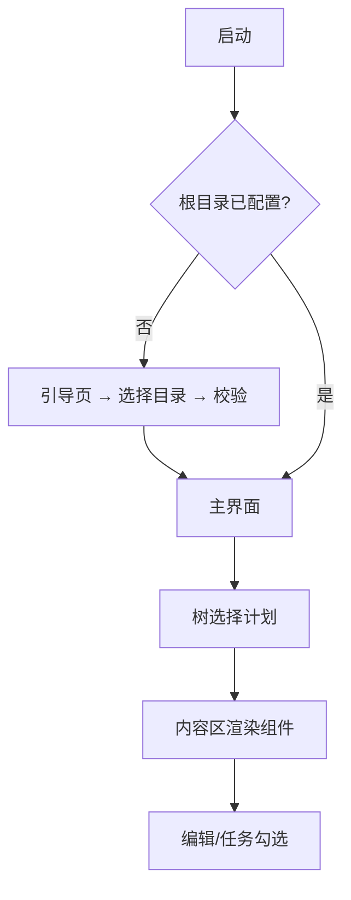
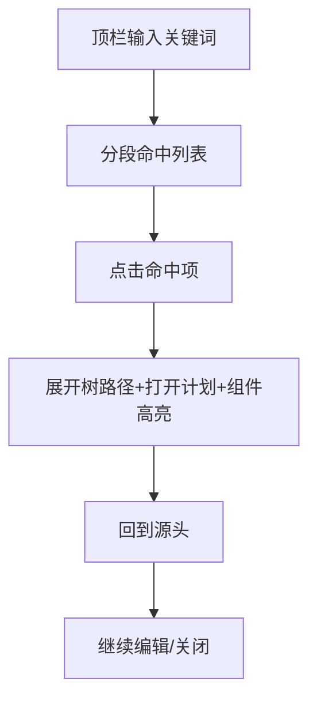

# 原型设计文档 Prototype Design Document

## 文档信息 Document Information

| 项目 Item | 内容 Content |
|---------|-------------|
| 文档版本 Document Version | v1.0.0 |
| 创建日期 Created Date | 2026-09-05 |
| 最后修改 Last Modified | 2026-09-05 |
| 设计师 Designer | HeYS-Snowe |
| 原型工具 Prototype Tool | □ Figma □ Axure □ Sketch □ 其他 ☑ 本阶段为 ASCII 低保真线框（工具化原型在 02 UI 规范后跟进） |

---

## 修改记录 Change History

| 版本 Version | 日期 Date | 修改人 Modifier | 审核人 Reviewer | 修改内容 Description |
|-------------|---------|---------------|---------------|-------------------|
| v1.0.0 | 2026-09-05 | HeYS-Snowe | HeYS-Snowe | 初始版本 Initial Version（低保真线框） |

---

## 目录 Table of Contents

1. [原型概述 Prototype Overview](#1-原型概述-prototype-overview)
2. [设计原则 Design Principles](#2-设计原则-design-principles)
3. [信息架构 Information Architecture](#3-信息架构-information-architecture)
4. [页面原型设计 Page Prototypes](#4-页面原型设计-page-prototypes)
5. [交互设计规范 Interaction Design](#5-交互设计规范-interaction-design)
6. [视觉设计规范 Visual Design Guidelines](#6-视觉设计规范-visual-design-guidelines)
7. [组件库 Design System](#7-组件库-design-system)

---

## 1. 原型概述 Prototype Overview

### 1.1 原型说明 Prototype Description

| 项目 Item | 内容 Content |
|---------|-------------|
| 原型类型 Prototype Type | □ 低保真 ☑ 中保真（结构+交互要点；视觉精修归 02 UI 设计规范） □ 高保真 |
| 交互程度 Interactivity | □ 静态 □ 可点击 ☑ 完整交互描述（本文档定义交互行为） |
| 覆盖范围 Scope | 主界面（计划库）、溯源查询、首次启动引导；组件态（渲染/编辑/完成） |

### 1.2 原型链接 Prototype Links

| 环境 Environment | 链接 Link | 访问密码 Password |
|--------------|---------|-----------------|
| 在线预览 Online Preview | 无（本阶段未工具化；02 跟进 Figma/代码原型） | - |
| 设计源文件 Source File | 本文档（ASCII 线框图） | - |

### 1.3 版本记录 Version History

| 版本 Version | 日期 Date | 主要变更 Major Changes |
|-------------|---------|---------------------|
| v1.0 | 2026-09-05 | 初始原型 Initial Prototype（低保真线框 + 交互定义） |
| v1.1 | 待定 | 依据组件语义评审结论调整 |
| v2.0 | 待定 | 工具化高保真原型（02 UI 规范后） |

---

## 2. 设计原则 Design Principles

### 2.1 核心设计原则 Core Design Principles

| 原则 Principle | 描述 Description | 应用示例 Application |
|--------------|----------------|-------------------|
| 计划先行 Plan First | 一切围绕"计划"对象组织：树即结构、内容即组件 | 左侧树全局唯一导航 |
| 所见即所得 WYSIWYG | 渲染即编辑，无模式切换 | 点组件即改，免 markdown |
| 少负担 Light Touch | 高频操作一步到达（勾选/新建树下拉/搜索） | 顶栏搜索 + 树右键新建 |
| 一致性 Consistency | 五类组件风格统一（同类型同构） | 任务类统一三态视觉 |
| 本地安全感 Trust | 明文件、可备份、动作可确认 | 删除/切换根目录二次确认 |
| 可访问性 Accessibility | 键盘可用、焦点可见 | Tab 导航 + 快捷键（搜索 Ctrl+F / 新建 Ctrl+N，待 02 定稿） |

### 2.2 设计决策记录 Design Decisions

| 决策 Decision | 原因 Rationale | 替代方案 Alternatives Considered |
|------------|--------------|-------------------------------|
| 树在左、内容在右的双栏 | 计划型工具的主流心智（文件管理器/笔记工具验证） | 顶部 Tab 平铺（失去结构感，弃） |
| 渲染即编辑（无编辑模式） | 「计划编辑难」痛点；markdown 直接编辑被否 | 编辑/预览两种模式（多余一步，弃） |
| 搜索为全局入口（顶栏常驻） | 「溯源查询困难」是命名级痛点，必须一步可达 | 二次进入的搜索页（多跳，弃） |
| 数据=明文件文件夹 | 可备份/可迁移/不锁定 | 私有库文件（迁移难，弃） |

---

## 3. 信息架构 Information Architecture

### 3.1 站点地图/应用地图 Site Map

```
应用窗口 App Window
├── 首次启动引导（一次性）
│   └── 选择计划库根目录
├── 主界面（计划库）
│   ├── 计划树（左栏）：根目录 → 计划文件夹 → 子计划（多级）
│   ├── 内容区（右栏）：当前计划组件序列
│   │   ├── 单选计划组件
│   │   ├── 多选计划组件
│   │   ├── 任务列表组件
│   │   ├── 任务详情组件
│   │   └── 注释组件
│   └── 顶栏：应用名 / 全局搜索框 / 新建计划
├── 溯源查询（顶栏浮层/结果面板）
│   ├── 命中列表（计划/任务/注释分段）
│   └── 回溯定位（树展开 + 高亮）
└── 设置（v1.0 仅：根目录切换入口）
```

### 3.2 用户流程图 User Flow Diagrams

#### 流程1：首次进入与主界面导航



#### 流程2：溯源查询与回溯



### 3.3 导航结构 Navigation Structure

| 导航类型 Navigation Type | 位置 Position | 包含项 Items |
|---------------------|-------------|------------|
| 主导航 Main Nav | 左侧树 | 根目录/计划/子计划（层级） + 右键操作 |
| 面包屑 Breadcrumb | 内容区顶部 | 根目录 > 计划 > 子计划（点击跳转） |
| 快捷导航 Quick Links | 顶栏全局搜索 | 溯源查询（任何位置可达） |

---

## 4. 页面原型设计 Page Prototypes

### 4.1 页面清单 Page List

| 页面ID Page ID | 页面名称 Page Name | 路径 Path（应用内） | 优先级 Priority | 状态 Status |
|--------------|-----------------|---------|---------------|------------|
| P-001 | 主界面（计划库） | 主窗口 | P0 | 已设计（见 4.2） |
| P-002 | 溯源查询 | 顶栏浮层/结果面板 | P0 | 已设计（见 4.2） |
| P-003 | 首次启动引导 | 首次启动页 | P0 | 已设计（见 4.2） |
| P-004 | 设置-根目录切换 | 主界面内入口 | P1 | 基于 P-003 复用 |

### 4.2 页面详细设计 Page Details

#### P-001: 主界面（计划库）

**页面描述 Page Description:**

| 属性 Attribute | 内容 Content |
|-------------|-----------|
| 页面名称 Page Name | 主界面（计划库） |
| 页面类型 Type | 双栏工作台（树 + 内容） |
| 目标用户 Target Users | 个人用户（UR-001） |
| 主要目标 Primary Goal | 计划导航、内容浏览与编辑、溯源入口 |

**页面布局 Layout:**

```
┌─────────────────────────────────────────────────────────────┐
│  █ 溯源 Trace            [ 搜索计划/任务/注释… ]    [+] 新建计划 │  顶栏 48px
├──────────────┬──────────────────────────────────────────────┤
│ 计划树        │  面包屑：计划库 > 2026-A 学期 > Web 全栈实训     │
│ ┌──────────┐ │ ┌──────────────────────────────────────────┐ │
│ │ 计划库    │ │ │ 单选计划 ──────────────────────────────── │ │
│ │ │ 学期计划 │ │ │  ▣ 本学期主线：技能大赛备赛        ☑ 已完成    │ │
│ │ │ │ 课程A  │ │ └──────────────────────────────────────────┘ │
│ │ │ │ 课程B  │ │ ┌──────────────────────────────────────────┐ │
│ │ │ 项目计划 │ │ │ 多选计划 ──────────────────────────────── │ │
│ │ │ │ Trace │ │ │  ⬜ 读原型文档  ☑ 定技术选型  ☑ 立项目      │ │
│ │ │ │ Loop  │ │ │                （已选 2/3）                │ │
│ │ │ 生活计划 │ │ └──────────────────────────────────────────┘ │
│ │ └────────┘│ │ ┌──────────────────────────────────────────┐ │
│ └──────────┘ │ │ 任务列表 ──────────────────────────────── │ │
│              │ │  [x] 01 功能规格评审    [ ] 02 学习 Rust     │ │
│              │ │  [x] 03 原型复审        [ ] 04 里程碑核销    │ │
│              │ └──────────────────────────────────────────┘ │
│              │ ┌──────────────────────────────────────────┐ │
│              │ │ 注释 ──────────────────────────────────── │ │
│              │ │   “反思：评审前置，返工减半。”              │ │
│              │ └──────────────────────────────────────────┘ │
├──────────────┴──────────────────────────────────────────────┤
│ 状态栏：索引已就绪 | 已保存 10s | 根目录：D:\Plans\Trace        │
└─────────────────────────────────────────────────────────────┘
```

**页面元素 Elements:**

| 元素ID Element | 类型 Type | 内容 Content | 交互 Interaction | 说明 Notes |
|--------------|---------|------------|----------------|----------|
| E-001-树 | 树控件 | 计划层级 | 点击选择 / 展开收起 / 右键（新建子计划、重命名、删除）/ 拖拽 | 结构与磁盘一致 |
| E-001-搜索 | 输入框 | 全局检索 | 聚焦弹出结果列表（见 P-002） | Ctrl+F 聚焦 |
| E-001-新建 | 按钮 | 新建计划 | 点击 → 树顶部/当前选中下内联输入名称 | 回车创建 |
| E-001-组件卡 | 组件卡片 | 5 类组件 | 点击字段进入编辑；工具栏（移动/删除组件） | 渲染即编辑 |
| E-001-状态栏 | 文本 | 索引/保存/路径 | 只读提示 | 保存状态防抖后显示 |

#### P-002: 溯源查询（结果浮层 + 回溯）

| 属性 Attribute | 内容 Content |
|-------------|-----------|
| 页面名称 Page Name | 溯源查询 |
| 页面类型 Type | 浮层（搜索框下拉 + 结果面板） |
| 目标用户 Target Users | UR-001 |
| 主要目标 Primary Goal | 检索命中 → 一键回到源头 |

**页面布局 Layout:**

```
┌─────────────────────────────────────────────────────────────┐
│  [ 溯源   ] X                                          [ ]  × │
├─────────────────────────────────────────────────────────────┤
│  计划（2）                                                 │
│  ▪ 2026-A 学期 . Web 全栈实训           [计划库>学期计划]     │
│  ▪ Trace 开发计划                        [计划库>项目计划]     │
│  任务（5）                                                 │
│  ▪ 功能规格评审（已完成）  …命中片段："规格"…                  │
│        计划库>项目计划>Trace>周计划                          │
│  注释（1）                                                 │
│  ▪ "评审前置，返工减半"           计划库>项目计划>Trace        │
├─────────────────────────────────────────────────────────────┤
│  （回溯后）树路径自动展开 + 组件定位滚动 + 2s 渐隐高亮           │
└─────────────────────────────────────────────────────────────┘
```

**页面元素 Elements:**

| 元素ID Element | 类型 Type | 内容 Content | 交互 Interaction | 说明 Notes |
|--------------|---------|------------|----------------|----------|
| E-002-输入 | 输入框 | 关键词 | 输入即查（300ms 防抖），ESC 关闭 | 多词 AND |
| E-002-分段 | 列表 | 计划/任务/注释 | 点击 → 回溯（树展开+高亮） | 显示类型徽标 |
| E-002-路径 | 文本 | 相对根目录路径 | 只读 | 移机不失效 |
| E-002-空态 | 文本 | "未命中，试试更短关键词" | - | - |

#### P-003: 首次启动引导

| 属性 Attribute | 内容 Content |
|-------------|-----------|
| 页面名称 Page Name | 首次启动引导 |
| 页面类型 Type | 引导页（一次性） |
| 目标用户 Target Users | UR-001 |
| 主要目标 Primary Goal | 配置计划库根目录 |

**页面布局 Layout:**

```
┌─────────────────────────────────────────────────────────────┐
│                                                             │
│                    ◆ 溯源 Trace                              │
│                     计划有迹可循                              │
│                                                             │
│   自定义计划库位置：计划将以“文件夹”保存在你指定的目录，           │
│   可随时整体备份、迁移（数据不出设备）。                        │
│                                                             │
│             [ 选择计划库目录 ]                                │
│                                                             │
│   已选：D:\Plans\Trace            ✓ 可读可写                  │
│                                                             │
│      [ 进入溯源 ]                                              │
│                                                             │
└─────────────────────────────────────────────────────────────┘
```

**页面元素 Elements:**

| 元素ID Element | 类型 Type | 内容 Content | 交互 Interaction | 说明 Notes |
|--------------|---------|------------|----------------|----------|
| E-003-说明 | 文本 | 明文件/备份承诺 | 只读 | 与隐私承诺一致（无网络） |
| E-003-选择 | 按钮 | 打开目录选择器 | 选择后校验回显 | 非法目录红色提示 |
| E-003-进入 | 按钮 | 完成配置 | 校验通过才可用 | - |

---

## 5. 交互设计规范 Interaction Design

### 5.1 交互模式 Interaction Patterns

| 交互类型 Interaction Type | 行为规范 Behavior | 示例 Example |
|------------------------|----------------|------------|
| 点击 Click | 单选组件字段即进入编辑（无模式切换） | 组件内编辑 |
| 悬停 Hover | 树节点显示操作区/插入线高亮 | 拖拽目标态 |
| 输入 Input | 即时校验（非法字符/空值），防抖保存 | 计划命名、任务标题 |
| 拖拽 Drag | 树内：插入线 + 目标展开（600ms 阈值）+ 非法位红显 | 计划结构调整 |
| 展开/收起 Expand | 树节点箭头；当前祖先自动展开（回溯时） | 溯源定位 |
| 搜索 Search | 防抖 300ms，结果实时分段 | 溯源查询 |

### 5.2 状态设计 State Design

**组件状态 Component States（5 类通用）:**

| 状态 State | 视觉表现 Visual | 反馈消息 Message |
|----------|---------------|---------------|
| 渲染态 Render | 正常样式（卡片/列表/引用） | - |
| 编辑态 Editing | 输入光标 + 边框高亮 | 状态栏"编辑中" |
| 保存态 Saved | 状态栏"已保存" | 防抖后显示 |
| 完成态 Done | 勾选 + 弱化（划线/减淡） | 单选/多选/任务 |
| 降级态 Fallback | 灰底占位 + 警告角标 | "内容格式异常" |

**树节点状态 Tree Node States:**

| 状态 State | 视觉表现 Visual | 可点击 Clickable |
|----------|---------------|---------------|
| 正常 Normal | 默认 | 是 |
| 悬停 Hover | 背景变化 | 是 |
| 选中 Selected | 高亮 + 操作图标 | 是 |
| 拖拽中 Dragging | 半透明拖影 | 否 |
| 拒绝 Drop | 红色插入线 | 否 |

### 5.3 动画规范 Animation Guidelines

| 动画类型 Animation | 持续时间 Duration | 缓动函数 Easing |
|-----------------|----------------|---------------|
| 树节点展开/收起 | 150ms | ease-out |
| 回溯定位高亮 | 渐隐 2000ms | ease-out |
| 拖拽插入线/预览 | 即时（无动画） | - |
| 空态到列表 | 200ms | ease-out |

---

## 6. 视觉设计规范 Visual Design Guidelines

> 本阶段为低保真定义；颜色/字体/阴影系统由 02「UI设计规范」完成精修。以下为原则级约定：

### 6.1 颜色系统 Color System（初稿取向）

| 颜色名称 Color Name | 色值 Hex | 应用场景 Usage |
|------------------|---------|--------------|
| 主色 Primary | 待定（倾向青蓝/深蓝，与"溯源/时间"语义契合；02 定案） | 主按钮、选中态、链接 |
| 功能色（完成） Success | 绿 | 任务完成 |
| 功能色（警告/逾期） Warning | 橙 | 逾期标记 |
| 功能色（错误） Error | 红 | 校验错误/破坏性操作 |
| 中性色 Neutral | 灰阶 | 文本/边框/背景 |

### 6.2 字体系统 Typography

| 平台 Platform | 字体 Font |
|-------------|----------|
| Windows | Microsoft YaHei（中文）/ Segoe UI（西文） |
| macOS（若跨平台） | PingFang SC / SF Pro |

**字体规范 Font Specifications:**

| 用途 Usage | 字号 Size | 字重 Weight | 行高 Line-height |
|---------|---------|-----------|---------------|
| 页面标题 | 18-20px | 600 | 1.3 |
| 计划名（树） | 13-14px | 500 | 1.4 |
| 组件标题 | 15px | 500-600 | 1.4 |
| 正文/任务文字 | 13-14px | 400 | 1.5 |
| 说明/状态栏 | 12px | 400 | 1.4 |

### 6.3 间距系统 Spacing System

| 间距名称 Spacing | 值 Value | 应用场景 Usage |
|---------------|---------|--------------|
| xs | 4px | 组件内紧凑间距 |
| sm | 8px | 树节点/列表项 |
| md | 12-16px | 组件卡片间距 |
| lg | 24px | 分区间距 |
| xl | 32px | 页面级留白（引导页） |

### 6.4 圆角与阴影 Border Radius & Shadow

| 元素类型 Element Type | 圆角半径 Radius |
|-------------------|---------------|
| 组件卡片/输入框 | 6-8px |
| 浮层/结果面板 | 8px |
| 弹窗/引导页 | 8-10px |
| 勾选框 | 4px |

| 阴影级别 Shadow Level | 样式 Box-shadow | 应用场景 Usage |
|-------------------|---------------|--------------|
| 轻微 Light | 0 1px 4px rgba(0,0,0,0.08) | 卡片 |
| 中等 Medium | 0 4px 16px rgba(0,0,0,0.12) | 浮层 |
| 重度 Heavy | 0 8px 24px rgba(0,0,0,0.16) | 弹窗 |

---

## 7. 组件库 Design System

### 7.1 基础组件 Basic Components

#### 按钮 Button

| 类型 Type | 样式 Style | 用途 Usage |
|----------|----------|----------|
| 主要按钮 Primary | 主色填充 | 新建计划、进入溯源 |
| 次要按钮 Secondary | 描边 | 次级操作 |
| 文字按钮 Text | 纯文本 | 树/卡片内操作 |
| 危险按钮 Danger | 红色 | 删除确认弹窗确认键 |

> 按钮尺寸：仅中号（桌面应用，不做响应式 3 档）。

#### 输入框 Input

| 状态 State | 样式 Style |
|----------|----------|
| 默认 Default | 灰边框 |
| 聚焦 Focused | 主色边框 |
| 错误 Error | 红边框 + 错误文案 |
| 禁用 Disabled | 灰背景 |

#### 树节点 Tree Node

| 元素 Element | 说明 Description |
|-----------|---------------|
| 展开箭头 | 有子节点时显示，点击折叠/展开 |
| 图标 | 计划（文件夹图标） |
| 名称 | 计划名（选中高亮） |
| 右键菜单 | 新建子计划/重命名/删除/复制路径 |

#### 弹窗 Modal

| 组成部分 Component | 说明 Description |
|-----------------|---------------|
| 遮罩层 Mask | 半透明 |
| 内容区 Container | 删除确认（递归提示）/ 根目录切换 |
| 头部 Header | 标题 |
| 底部 Footer | 确认（危险色）/ 取消 |

### 7.2 业务组件 Business Components

#### 计划单片组件卡片（5 类）

```
单选计划             多选计划
┌────────────────┐   ┌────────────────┐
│▣ 标题           │   │▣ 标题           │
│ ☑ 完成          │   │ ⬜ 选项A ☑ 选项B │
│ 摘要…           │   │ 摘要… 已选 1/2  │
└────────────────┘   └────────────────┘
任务详情            注释
┌────────────────┐   ┌────────────────┐
│▣ 标题           │   │  注释（引用样式） │
│ 描述…           │   │  文本…          │
│ 状态:进行中 时间 │   └────────────────┘
└────────────────┘
任务列表
┌──────────────────────────┐
│▣ 标题                     │
│ [ ] 任务A（进行中）        │
│ [x] 任务B（完成）          │
└──────────────────────────┘
```

#### 树节点列表项

```
┌──────────────────────────────┐
│ [▸] 📁 2026-A 学期      (2)  │
│   [▾] 📁 Web 全栈实训    (1)  │
│      [▸] 📁 周计划       (3) │
└──────────────────────────────┘
```

#### 溯源结果项

```
┌──────────────────────────────┐
│ [任务] 功能规格评审   已完成   │
│  命中片段：“…评审前置…“        │
│  计划库>项目计划>Trace>周计划   │
└──────────────────────────────┘
```

---

## 附录 Appendix

### 附录A：图标库 Icon Library

| 图标名称 Icon Name | 用途 Usage | 来源 Source |
|-----------------|----------|-----------|
| 计划（文件夹） | 树节点 | 框架图标库（02 定） |
| 任务 | 结果分段/组件 | 同上 |
| 注释 | 结果分段/组件 | 同上 |
| 搜索 | 顶栏入口 | 同上 |

### 附录B：图片资源 Image Resources

| 资源名称 Resource Name | 规格 Size | 用途 Usage |
|---------------------|---------|----------|
| 无内置图片（v1.0） | - | 组件不含图片内容 |

### 附录C：设计交付物 Design Deliverables

| 交付物 Deliverable | 格式 Format | 说明 Description |
|------------------|---------|---------------|
| 原型文件 Prototype | 本文档（ASCII 线框） | 交互定义（本阶段） |
| 设计规范 Spec | 02「UI设计规范」 | 颜色/字体/阴影精修 |
| 切图资源 Assets | 02 产出 | 框架图标为主 |
| 标注文档 Annotations | 02 产出 | 与 UI 规范合并交付 |

---

## 审批与签署 Approvals

| 角色 Role | 姓名 Name | 签名 Signature | 日期 Date |
|----------|---------|--------------|---------|
| 产品经理 Product Manager | HeYS-Snowe | 电子批准 | 2026-09-05 |
| 设计师 Designer | HeYS-Snowe | 电子批准 | 2026-09-05 |
| 前端负责人 Frontend Lead | HeYS-Snowe | 电子批准 | 2026-09-05 |

---

**文档结束 End of Document**

**注意:** 本文档描述产品原型和设计规范，详细的功能规格请参考《功能规格说明书》。
